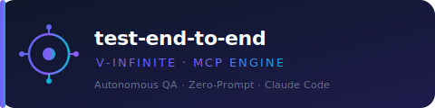
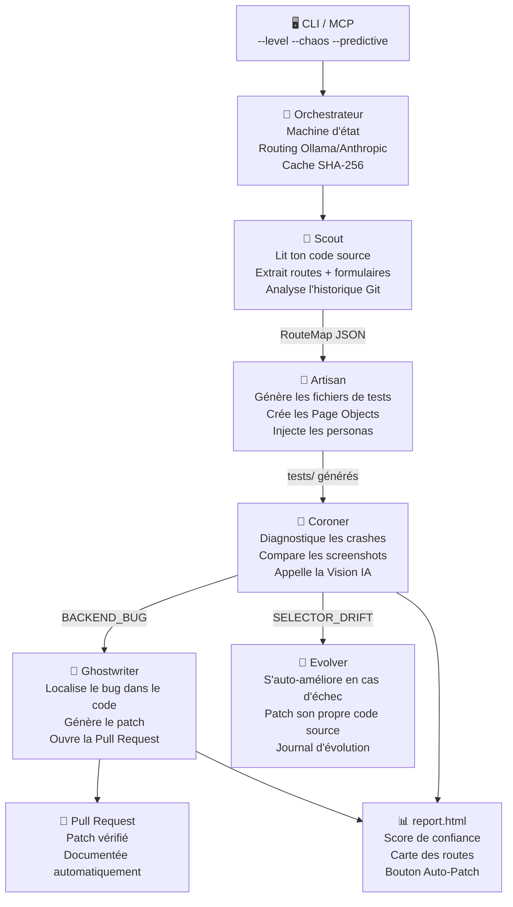
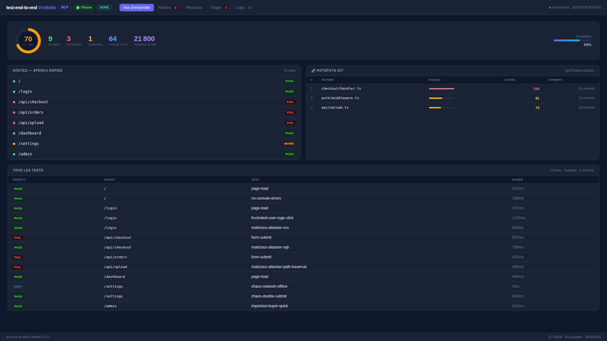
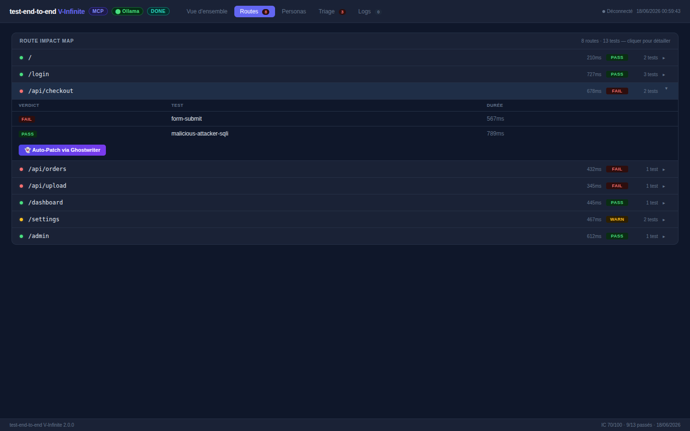
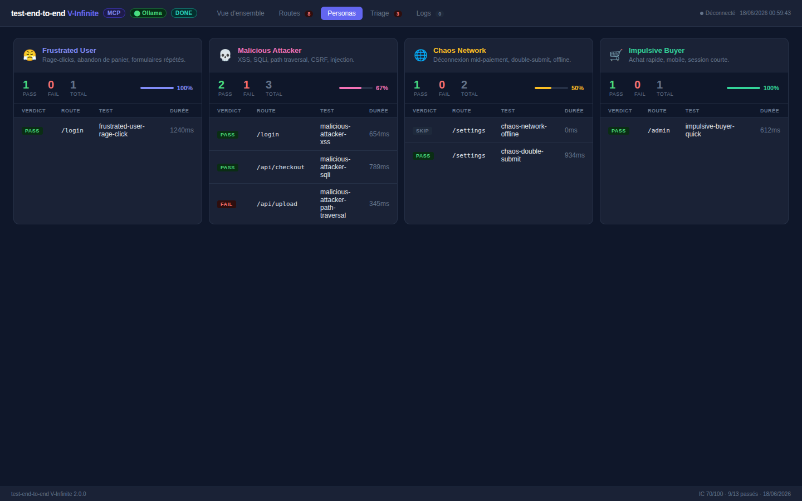
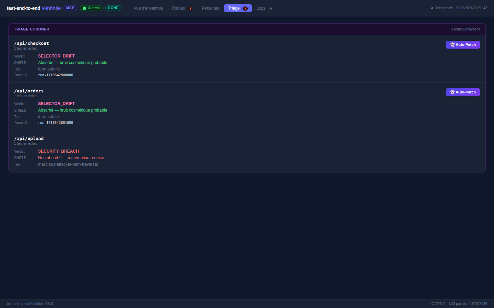

<p align="center">
  
</p>

<p align="center">
  <a href="https://github.com/Aronbfrt/test-end-to-end/releases"></a>
  
  
  
  
</p>

<h3 align="center">L'usine de QA cognitive autonome pour Claude Code.</h3>

<p align="center">
  Tu pointes le plugin sur n'importe quel projet. Il lit ton code source, comprend tes routes et tes formulaires,<br>
  génère une batterie de tests E2E complets, diagnostique chaque crash avec l'IA,<br>
  répare automatiquement les sélecteurs cassés, et ouvre des Pull Requests avec des patchs chirurgicaux.<br>
  <b>Zéro configuration manuelle. Zéro prompt humain à écrire.</b>
</p>

<p align="center">
  <a href="#-prérequis"><b>Prérequis</b></a> ·
  <a href="#-installation-du-plugin"><b>Installation</b></a> ·
  <a href="#-démarrage-rapide"><b>Démarrage rapide</b></a> ·
  <a href="#️-commandes-en-détail"><b>Commandes</b></a> ·
  <a href="#-architecture"><b>Architecture</b></a> ·
  <a href="#-dashboard"><b>Dashboard</b></a>
</p>

---

## ✅ Prérequis

Avant d'installer le plugin, vérifie que tu as ces outils sur ta machine. Sans eux, certaines fonctionnalités ne marcheront pas.

### Obligatoires

| Outil | Version minimum | Pourquoi c'est nécessaire | Installation |
|---|---|---|---|
| **Node.js** | 18.0+ | Fait tourner le moteur TypeScript du plugin | [nodejs.org](https://nodejs.org) |
| **npm** | 9.0+ | Installé automatiquement avec Node.js | — |
| **Git** | 2.x | Requis pour l'analyse Git forensique et la création de branches automatiques | [git-scm.com](https://git-scm.com) |
| **Claude Code** | latest | L'environnement depuis lequel tu lances les commandes slash | `npm install -g @anthropic/claude-code` |

### Fortement recommandé — Ollama (économie de tokens IA)

**Ollama** est un logiciel gratuit qui fait tourner des modèles IA directement sur ta machine. Sans lui, toutes les analyses passent par l'API Anthropic (tokens payants). Avec lui, environ **94% des traitements se font en local**, gratuitement.

```bash
# macOS / Linux — une seule commande
curl -fsSL https://ollama.ai/install.sh | sh

# Windows — télécharger l'installeur sur https://ollama.ai/download

# Après installation, télécharger le modèle recommandé
ollama pull llama3.2

# Vérifier qu'Ollama tourne bien
ollama list
# → tu dois voir "llama3.2" dans la liste
```

> **Ollama n'est pas obligatoire.** Si tu ne l'installes pas, le plugin utilise l'API Claude normalement — ça marche pareil, mais consomme des tokens pour chaque analyse.

### Optionnel — GitHub CLI (pour la création automatique de PRs)

Si tu veux que le plugin ouvre des Pull Requests automatiquement quand il trouve un bug, il faut `gh` installé et connecté à GitHub.

```bash
# macOS
brew install gh

# Ubuntu / Debian
sudo apt install gh

# Windows
winget install --id GitHub.cli

# Connexion à GitHub
gh auth login
```

### Optionnel — Playwright (pour exécuter les tests générés)

Le plugin *génère* les tests Playwright. Pour les *exécuter* localement :

```bash
npm install -g @playwright/test
npx playwright install chromium
```

---

## 📦 Installation du plugin

### Étape 1 — Installer le plugin dans Claude Code

```bash
claude plugin install https://github.com/Aronbfrt/test-end-to-end
```

Cette commande télécharge le plugin et le rend disponible dans Claude Code sous forme de commandes slash (`/e2e-init`, `/e2e-audit`, etc.).

### Étape 2 — Installer les dépendances du moteur TypeScript

```bash
# Aller dans le dossier du plugin (le chemin peut varier selon ton OS)
cd ~/.claude/plugins/marketplaces/test-end-to-end

# Installer les dépendances Node.js
npm install

# Compiler le moteur TypeScript en JavaScript
npm run build
```

> **Pourquoi cette étape ?** Le moteur V-Infinite est écrit en TypeScript. GitHub stocke le code source, mais Node.js a besoin du JavaScript compilé pour l'exécuter. Cette étape est à faire **une seule fois** après l'installation, puis à refaire uniquement si tu mets à jour le plugin.

### Étape 3 — Vérifier que tout fonctionne

```bash
node dist/index.js --help
```

Tu dois voir ceci :

```
test-end-to-end V-Infinite 2.0.0 — Autonomous QA Engine

USAGE
  node dist/index.js <command> [targetPath] [flags]

COMMANDS
  init        Initialise le projet cible : détecte le stack, amorce le cache,
              génère la config Playwright/Cypress.
              Ex: node dist/index.js init
                  node dist/index.js init /mon/projet

  audit       Audit E2E complet : scan AST → génération tests → triage → rapport.
              Ex: node dist/index.js audit
                  node dist/index.js audit --level=2 --predictive

  shadow      Zero-prompt Reverse Testing + Shadow Personas (Frustrated / Attacker /
              Chaos / Impulsive). Fonctionne sans qu'on décrive une seule fonctionnalité.
              Ex: node dist/index.js shadow --level=3 --chaos

  diff        Cible le scan sur les fichiers modifiés (git diff HEAD + staged).
              --predictive ajoute les hotspots Git des 12 derniers mois.
              Ex: node dist/index.js diff
                  node dist/index.js diff --predictive --level=2

  repair      Active Ghostwriter pour patcher un bug confirmé par le Coroner.
              Charge automatiquement le dernier triage (.e2e-work/*.triage.json).
              Ex: node dist/index.js repair
                  node dist/index.js repair --trace=run-1718542800000

  coverage    Carte de couverture : routes + forms vs fichiers de test existants.
              Génère .e2e-work/coverage.html et coverage.json.
              Ex: node dist/index.js coverage
                  node dist/index.js coverage --detail

  update      Sync intelligent après changements de code.
              Compare routes actuelles vs snapshot (.e2e-work/last-routes.json),
              génère uniquement les tests manquants. Protège les tests manuels.
              Ex: node dist/index.js update
                  node dist/index.js update --dry-run

FLAGS
  --level=1         Déterministe local — AST pur, sans LLM
  --level=2         Hybride cognitif — Vision IA sur sélecteur cassé (défaut)
  --level=3         Meta-Agent Infinite — Shadow Personas + Ghostwriter + Evolver
  --chaos           Inject scénarios de faute réseau / double-submit / i18n
  --predictive      Git forensics 12 mois → hotspot ranking
  --dry-run         Affiche ce qui serait fait sans écrire de fichier (update)
  --detail          Sortie détaillée par route (coverage)
  --trace=<id>      Charge un triage spécifique par son identifiant (repair)
  --reset-cache     Vide le cache d'empreintes SHA-256
  --mcp             Démarre en mode serveur MCP (stdin/stdout JSON-RPC)

DASHBOARD
  node dist/server/start.js     → http://127.0.0.1:4321

MCP (.mcp.json)
  { "mcpServers": { "e2e": { "command": "node",
    "args": ["/chemin/dist/index.js", "--mcp"] } } }
```

Si tu vois une erreur, vérifie que Node.js 18+ est bien installé.

---

## 🚀 Démarrage rapide

Voici comment utiliser le plugin sur ton projet en 2 minutes.

### Utilisation via les commandes slash (le plus simple)

Ouvre Claude Code sur ton projet, puis tape directement dans le chat :

```
/e2e-init
```

Claude va t'accompagner pas à pas pour configurer les tests sur ton projet. Il détecte automatiquement ton framework (Next.js, Express, Laravel, Rails, Django…) et génère la configuration adaptée.

### Utilisation via le CLI (contrôle total)

```bash
# Lancer un audit complet sur ton projet (remplace /chemin/vers/ton/projet)
node ~/.claude/plugins/marketplaces/test-end-to-end/dist/index.js audit /chemin/vers/ton/projet --level=2

# Exemple concret si ton projet est dans ~/dev/mon-app
node ~/.claude/plugins/marketplaces/test-end-to-end/dist/index.js audit ~/dev/mon-app --level=2 --predictive
```

### Résultat attendu

Après la première exécution, tu trouveras dans `.e2e-work/` :
- Les tests générés dans `tests/`
- Un rapport `report.html` avec le score de confiance
- Un log de ce que l'IA a découvert dans ton code

---

## 🖥️  Commandes en détail

Le plugin offre deux types d'interface : les **commandes slash** (pour une utilisation guidée dans Claude Code) et le **CLI** (pour une utilisation directe dans le terminal avec plus de contrôle).

> **Important :** Les flags comme `--level=2` ou `--predictive` ne s'utilisent **jamais seuls**. Ils se combinent toujours avec une commande. Exemples corrects et incorrects :
> ```bash
> # ❌ Ne fonctionne pas — manque la commande
> node dist/index.js --level=2
>
> # ✅ Correct — commande + flags
> node dist/index.js audit --level=2 --predictive
> ```

---

### `/e2e-init` — Initialisation guidée du projet

**Ce que ça fait :** C'est la première commande à lancer sur un nouveau projet. Elle analyse ton code source pour détecter automatiquement ta stack technique (Next.js, Express, Nuxt, Laravel, Django, Rails…), puis génère tous les fichiers de configuration nécessaires pour les tests E2E. Elle installe aussi les dépendances manquantes et crée des exemples de tests pour chaque route détectée.

**Quand l'utiliser :** Une seule fois, au début, quand tu mets en place les tests sur un projet qui n'en a pas encore.

```bash
# Via Claude Code (recommandé — mode guidé interactif)
/e2e-init

# Via CLI — initialise le projet dans le dossier courant
node dist/index.js init

# Via CLI — initialise un projet spécifique
node dist/index.js init /chemin/vers/ton/projet
```

**Résultat :** Un dossier `tests/` est créé avec une structure Page Object Model (POM), un fichier de configuration Playwright ou Cypress adapté à ton projet, et des tests de base prêts à être exécutés.

---

### `/e2e-audit` — Audit E2E complet automatique

**Ce que ça fait :** C'est la commande principale du plugin. Elle effectue un audit complet de ton application en plusieurs passes : tests fonctionnels de base (chaque page s'ouvre-t-elle ?), tests de sécurité (injection SQL, XSS, traversée de répertoires), tests SEO (balises meta, robots.txt, sitemap), tests d'accessibilité (ARIA, contraste, navigation clavier), tests de performance (temps de chargement, Core Web Vitals), et tests responsive (mobile, tablette, desktop). À la fin, elle génère un rapport HTML avec un **score de confiance** de 0 à 100.

**Quand l'utiliser :** Avant chaque déploiement, après une grosse modification du code, ou quand tu veux avoir une vue d'ensemble de l'état de santé de ton application.

```bash
# Via Claude Code
/e2e-audit

# Via CLI — niveau 1 : analyse locale uniquement, sans IA (le plus rapide, 0 token)
node dist/index.js audit --level=1

# Via CLI — niveau 2 : analyse + Vision IA sur les sélecteurs cassés (recommandé)
node dist/index.js audit --level=2

# Via CLI — niveau 2 + forensique Git (détecte les fichiers historiquement risqués)
node dist/index.js audit --level=2 --predictive

# Via CLI — niveau 3 : audit complet avec personas cyber-attaquants + auto-patch PR
node dist/index.js audit --level=3 --chaos --predictive
```

**Les 3 niveaux en détail :**

| Niveau | Ce qui est activé | Coût IA | Temps estimé |
|---|---|---|---|
| `--level=1` | Analyse AST locale + génération de tests. Aucun appel IA. | 0 token | < 30 sec |
| `--level=2` *(défaut)* | Tout le niveau 1 + Vision IA pour réparer les sélecteurs cassés + triage intelligent des crashes | Quelques appels | 1–3 min |
| `--level=3` | Tout le niveau 2 + les 3 personas cyber-attaquants (XSS, injection…) + création automatique de PR de correction + auto-évolution du plugin | Plus d'appels | 3–10 min |

---

### `/e2e-coverage` — Carte de couverture des tests

**Ce que ça fait :** Analyse ton codebase et compare les routes/endpoints existants dans ton code aux tests E2E actuellement en place. Te donne une carte visuelle précise : "tu as 47 routes, 31 sont couvertes (66%), il manque ces 16-là". Identifie aussi les formulaires non testés et les endpoints API sans couverture.

**Quand l'utiliser :** Quand tu veux savoir où sont tes angles morts en matière de tests, ou pour justifier auprès d'une équipe le niveau de couverture actuel.

```bash
# Via Claude Code
/e2e-coverage

# Via CLI — génère le rapport de couverture
node dist/index.js coverage

# Rapport avec détail par catégorie (routes / forms / API)
node dist/index.js coverage --detail
```

---

### `/e2e-update` — Mise à jour intelligente des tests

**Ce que ça fait :** Quand tu ajoutes de nouvelles fonctionnalités à ton application, tes tests existants deviennent incomplets. Cette commande détecte automatiquement ce qui a changé depuis le dernier audit (nouvelles routes, formulaires modifiés, endpoints ajoutés) et génère uniquement les tests manquants — **sans jamais écraser les tests que tu as écrits manuellement**.

**Quand l'utiliser :** Après avoir ajouté une nouvelle page, un nouveau formulaire, ou un nouvel endpoint API à ton application.

```bash
# Via Claude Code
/e2e-update

# Via CLI — détecte les changements et met à jour les tests
node dist/index.js update

# Avec prévisualisation de ce qui va changer (sans modifier les fichiers)
node dist/index.js update --dry-run
```

---

### `shadow` — Reverse Testing avec personas extrêmes

**Ce que ça fait :** Plutôt que de tester "le comportement normal d'un utilisateur", cette commande génère des tests qui simulent des comportements extrêmes : un utilisateur frustré qui clique frénétiquement partout, un acheteur impulsif qui essaie de passer une commande sans remplir les champs obligatoires, et un attaquant malveillant qui tente des injections XSS, SQL et des traversées de répertoires. C'est l'équivalent d'un pentest automatisé intégré à tes tests E2E.

**Quand l'utiliser :** Avant un lancement public, ou sur des fonctionnalités critiques (paiement, authentification, upload de fichiers).

```bash
# Via CLI — active les 3 personas sur toutes les routes
node dist/index.js shadow --level=2

# Avec simulation de pannes réseau en plus (connexion coupée en plein milieu d'un formulaire…)
node dist/index.js shadow --level=2 --chaos

# Version complète : personas + réseau + auto-patch si bugs trouvés
node dist/index.js shadow --level=3 --chaos
```

---

### `diff` — Tests ciblés sur les fichiers modifiés

**Ce que ça fait :** Au lieu d'analyser tout ton projet à chaque fois (ce qui peut être long sur un gros projet), cette commande regarde uniquement les fichiers que tu as modifiés depuis ton dernier commit Git. Elle génère ou met à jour des tests uniquement pour ce qui a changé. Avec `--predictive`, elle ajoute aussi les fichiers historiquement risqués (ceux qui ont le plus souvent causé des bugs dans le passé selon l'historique Git).

**Quand l'utiliser :** Dans ton workflow quotidien, avant chaque commit, pour tester rapidement ce que tu viens de modifier.

```bash
# Via CLI — teste uniquement les fichiers modifiés depuis le dernier commit
node dist/index.js diff

# Avec overlay des fichiers historiquement risqués
node dist/index.js diff --predictive

# Avec niveau 2 (Vision IA activée)
node dist/index.js diff --level=2 --predictive
```

---

### `repair` — Réparation autonome d'un bug diagnostiqué

**Ce que ça fait :** Si un audit précédent a détecté et diagnostiqué un bug (via le Coroner), cette commande prend le rapport de triage, localise le fichier source concerné, génère un patch via Claude, l'applique, vérifie que les tests passent, et crée une Pull Request documentée sur GitHub. Tout ça sans que tu aies à toucher une ligne de code.

**Quand l'utiliser :** Après un audit de niveau 2 ou 3 qui a identifié un `BACKEND_BUG`. Le plugin t'indique quand un bug est réparable automatiquement.

```bash
# Via CLI — charge le dernier triage et tente la réparation
node dist/index.js repair

# Sur un triage spécifique (identifiant visible dans report.html)
node dist/index.js repair --trace=run-1718542800000
```

---

### Intégration MCP — Donner le contrôle à Claude directement

**Ce que c'est :** En mode MCP (Model Context Protocol), le plugin se transforme en "serveur d'outils" que Claude peut appeler directement, sans que tu aies besoin de taper des commandes. Claude peut décider lui-même de lancer un audit, regarder la couverture, ou réparer un bug, en réponse à tes questions en langage naturel.

**Comment l'activer :** Crée un fichier `.mcp.json` **à la racine de TON projet** (pas dans le dossier du plugin), avec ce contenu :

```jsonc
// .mcp.json — à créer à la racine de ton projet applicatif
{
  "mcpServers": {
    "e2e": {
      "command": "node",
      "args": ["dist/index.js", "--mcp"],
      "cwd": "/chemin/absolu/vers/test-end-to-end"
    }
  }
}
```

> Remplace `/chemin/absolu/vers/test-end-to-end` par le chemin réel vers le dossier du plugin sur ta machine. Exemple : `/Users/aron/.claude/plugins/marketplaces/test-end-to-end`

Une fois configuré, Claude peut utiliser ces 8 outils automatiquement :

| Outil MCP | Équivalent CLI | Ce que Claude peut faire |
|---|---|---|
| `e2e_init` | `init` | Initialiser les tests sur ton projet |
| `e2e_audit` | `audit` | Lancer un audit complet |
| `e2e_shadow` | `shadow` | Tester les personas extrêmes |
| `e2e_diff` | `diff` | Tester uniquement les fichiers modifiés |
| `e2e_repair` | `repair` | Réparer un bug diagnostiqué |
| `e2e_coverage` | `coverage` | Carte de couverture routes + forms |
| `e2e_update` | `update` | Sync tests après changements de code |
| `e2e_diagnostics` | — | Voir l'état du plugin (cache, Ollama, état) |

---

## ⚡ Architecture

Le plugin est organisé en 5 agents spécialisés qui travaillent en séquence, orchestrés par un cerveau central.



**Le flux en langage simple :**

1. **Scout** — lit ton projet, identifie toutes les pages, routes et formulaires. C'est la phase de "cartographie".
2. **Artisan** — prend cette carte et génère les fichiers de tests correspondants. C'est lui qui écrit les scripts Playwright ou Cypress.
3. **Coroner** — après exécution des tests, analyse les échecs. Distingue un crash serveur (500) d'un sélecteur HTML qui a changé.
4. **Ghostwriter** — quand un bug serveur est confirmé, il trouve le code responsable, génère un correctif, et ouvre une PR.
5. **Evolver** — si un agent échoue de manière répétée, il lit son propre code source et se corrige lui-même (guaranti max 3 tentatives/24h).

---

## 💡 Zero-Token Bypass — Comment le plugin évite de dépenser des tokens inutilement

### Le problème qu'il résout

Chaque fois qu'un outil IA analyse du code, il envoie ce code à un modèle de langage (Claude, GPT…) qui consomme des "tokens" — l'unité de mesure qui détermine le coût. Si tu as un projet de 200 fichiers et que tu lances un audit tous les jours, tu pourrais dépenser beaucoup de tokens pour analyser des fichiers qui n'ont pas changé depuis la veille.

### La solution : une empreinte digitale par fichier

À chaque scan, le plugin calcule une **empreinte numérique unique** (SHA-256) pour chaque fichier — comme une signature qui change si et seulement si le contenu du fichier change. Ces empreintes sont stockées dans `.e2e-cache.json`.

Lors du scan suivant, le plugin compare les empreintes actuelles avec celles sauvegardées :
- **Empreinte identique** → fichier non modifié → **aucun agent activé, 0 token dépensé**
- **Empreinte différente** → fichier modifié → l'agent est activé pour analyser les changements

```
1er scan (rien en cache) :  73 fichiers → 73 analysés  → coût normal
2e scan (cache chaud)    :  73 fichiers → 0 analysé    → 0 token dépensé ✓
Après modification code  :  73 fichiers → 3 analysés   → seulement 3 fichiers modifiés
```

### Et Ollama dans tout ça ?

**Ollama** est un logiciel qui fait tourner des modèles IA sur ta propre machine, gratuitement. Le plugin détecte automatiquement si Ollama est installé et actif. Quand c'est le cas :

- Les tâches "légères" (analyse AST, classification de sélecteurs, résumé de code) partent vers Ollama → **gratuit, local, rapide**
- Les tâches "lourdes" (Vision QA sur screenshots, génération de patchs complexes) partent vers Claude (Anthropic) → **seulement quand nécessaire**

Sans Ollama : tout passe par Anthropic.  
Avec Ollama : environ 94% du traitement se fait en local, gratuitement.

### La compression Byte-State (réduction supplémentaire)

Quand une page HTML doit quand même être envoyée à un modèle IA (par exemple pour analyser un crash), le plugin la compresse en 3 passes avant de l'envoyer :

1. **Purge** — supprime tout ce qui n'est pas utile pour comprendre la structure : balises `<script>`, `<style>`, attributs `on*` (onclick, onmouseover…), data-URIs, éléments cachés (`aria-hidden=true`)
2. **Fusion** — regroupe les éléments identiques répétés : si tu as 50 lignes `<li class="item">`, elles deviennent `li.item × 50`
3. **Sérialisation** — encode la structure restante sous forme compacte avec des clés à 2 caractères

**Résultat mesuré :** 18 580 octets → 1 002 octets (réduction de 94,6%)

---

## 🔮 Dashboard — Interface temps réel

Le dashboard est une interface web qui s'ouvre dans ton navigateur pendant l'exécution d'un audit. Elle affiche en temps réel chaque action des agents, les captures d'écran comparatives, et le score final.

```bash
# Démarrer le dashboard (port 4321 par défaut)
node dist/server/start.js

# Sur un projet spécifique
node dist/server/start.js /chemin/vers/ton/projet

# Port personnalisé
E2E_PORT=4444 node dist/server/start.js

# Ouvrir dans le navigateur
open http://127.0.0.1:4321
```

<p align="center">
  
  <br>
  <i>Vue d'ensemble — IC ring, métriques, aperçu routes, hotspots Git forensics, table complète des tests.</i>
</p>

<p align="center">
  
  <br>
  <i>Onglet Routes — chaque route cliquable pour révéler ses tests, durée moyenne, badge PASS/FAIL/WARN.</i>
</p>

<p align="center">
  
  <br>
  <i>Onglet Personas — 4 profils (Frustrated, Attacker, Chaos, Impulsive) avec stats pass/fail et tests par profil.</i>
</p>

<p align="center">
  
  <br>
  <i>Onglet Triage — verdict par route en échec (SELECTOR_DRIFT ou SECURITY_BREACH), analyse SHIELD, bouton Auto-Patch.</i>
</p>

**Fonctionnalités du dashboard :**

| Fonctionnalité | Description |
|---|---|
| Log temps réel | Chaque ligne d'action des 5 agents apparaît instantanément |
| Carte des routes | Chaque route colorée en vert (OK), orange (warning), rouge (crash) |
| Score de confiance | Indice calculé en direct de 0 à 100 |
| Comparaison screenshots | Vue côte à côte avant/après pour les changements visuels |
| Bouton Auto-Patch | Lance le Ghostwriter directement depuis l'interface |

**Endpoints disponibles :**

| Route | Description |
|---|---|
| `GET /` | Page principale du dashboard |
| `GET /api/status` | État de l'orchestrateur + capacité Ollama en JSON |
| `GET /api/report` | Rapport complet au format JSON |
| `POST /api/repair` | Déclenche une réparation pour un `traceId` donné |
| `WS /ws` | Connexion WebSocket pour le flux d'événements temps réel |

---

## 👤 Shadow Personas — Tester les comportements extrêmes

### Pourquoi tester des comportements "anormaux" ?

Un test classique vérifie que l'utilisateur "parfait" — celui qui remplit tous les champs correctement, clique au bon endroit, attend que la page charge — obtient le résultat attendu. Mais en production, les vrais utilisateurs ne se comportent pas comme ça. Et les attaquants non plus.

Les Shadow Personas sont des profils de comportement extrêmes qui génèrent des tests réalistes pour des situations difficiles.

### Les 4 personas

**`frustrated_user` — L'utilisateur frustré**

Simule quelqu'un qui s'énerve parce que la page est lente ou peu claire. Tests générés : clics frénétiques rapides sur les boutons (×3 en moins de 500ms), abandon de formulaire à mi-chemin et retour en arrière, soumission répétée du même formulaire, navigation via le bouton "Précédent" du navigateur en plein milieu d'un checkout.

**`impulsive_buyer` — L'acheteur impulsif**

Simule quelqu'un qui veut aller vite et qui ignore les consignes. Tests générés : tentative de soumission d'un formulaire avec des champs obligatoires vides, bypass des étapes de validation, passage direct à la page de paiement sans passer par le panier.

**`malicious_attacker` — L'attaquant malveillant**

Simule une tentative d'intrusion. Tests générés :
- **XSS (6 payloads)** : tentatives d'injection de code JavaScript dans les champs de formulaire
- **Injection SQL (5 payloads)** : tentatives de manipulation de la base de données via les inputs
- **Path Traversal (3 payloads)** : tentatives d'accès à des fichiers système via les URLs
- **Prompt Injection** : si le plugin détecte une route IA (`/chat`, `/ask`, `/assistant`…), il tente des attaques spécifiques aux LLM

**`chaos_network` — Le réseau instable**

Simule une connexion internet de mauvaise qualité. Tests générés : coupure de connexion en plein milieu d'un envoi de formulaire, throttling à 200ms par requête (simulation 3G faible), double-clic sur le bouton "Valider" pour tester l'idempotence (le serveur traite-t-il la commande deux fois ?).

### Comment activer les personas

```bash
# Activer les 4 personas sur toutes les routes détectées
node dist/index.js shadow --level=2

# Ajouter aussi la simulation réseau instable
node dist/index.js shadow --level=2 --chaos

# Version maximale : personas + réseau + correction automatique des bugs trouvés
node dist/index.js shadow --level=3 --chaos

# Ou via Claude Code
/e2e-audit   # puis répondre "oui" quand Claude propose d'activer les personas
```

---

## 🔬 SHIELD — Pourquoi un test de sélecteur échoue ≠ un vrai bug

### Le problème des faux positifs

Un test E2E comme `expect(page.locator('.btn-submit')).toBeVisible()` peut échouer pour deux raisons très différentes :

1. **Le bouton n'existe vraiment plus** — c'est un vrai bug, il faut alerter
2. **Le développeur a renommé la classe CSS** de `.btn-submit` en `.btn-submit-primary` — ce n'est pas un bug, juste un changement de style

Sans SHIELD, les deux cas déclenchent la même alerte rouge, ce qui génère des faux positifs épuisants.

### Comment SHIELD fonctionne

Quand un sélecteur ne se trouve plus, le Coroner prend deux screenshots (avant le test / après l'échec) et les compare pixel par pixel. Chaque pixel est mesuré en distance euclidienne RGBA (rouge + vert + bleu + transparence).

- **Tolérance par canal :** `32/255` — absorbe les micro-différences dues à l'anti-aliasing des polices, au rendu ClearType de Windows, ou aux différences entre OS
- **Seuil de déclenchement :** `1% des pixels doivent être différents` pour considérer qu'il y a un vrai changement visuel

| Résultat de la comparaison | Verdict | Action |
|---|---|---|
| Moins de 1% de pixels différents | `SHIELD ABSORBÉ — bruit cosmétique` | Aucune alerte. Le sélecteur a juste été renommé → Vision QA trouve le nouveau nom |
| Plus de 5% de pixels différents | `VRAI CHANGEMENT VISUEL` | Alerte réelle. L'interface a changé significativement |

**Quand SHIELD ne suffit pas :** la Vision QA prend le relais — Claude analyse le screenshot et propose un nouveau sélecteur CSS résistant aux renommages.

---

## 🧬 Forensique Git — Trouver les fichiers les plus risqués

### Le principe

Tous les fichiers d'un projet ne méritent pas la même attention. Un fichier qui a été modifié 50 fois en 12 mois, avec des commits intitulés "hotfix urgent", "wtf ça marche pas", "revert du revert"… est statistiquement plus susceptible de causer des bugs qu'un fichier stable qui n'a pas changé depuis 6 mois.

Avec `--predictive`, le plugin analyse les 12 derniers mois de `git log` et calcule un **score de risque** pour chaque fichier.

### Comment le score est calculé

```
score_risque = fréquence_modification × 1.0 + score_stress × 1.5
```

Le score de stress est calculé en cherchant des mots-clés dans les messages de commits :

| Mots dans les commits | Score de stress ajouté |
|---|---|
| `fix`, `hotfix`, `urgent`, `critical`, `asap` | +3 |
| `wip`, `temp`, `hack`, `dirty`, `quick` | +2 |
| Jurons (`crap`, `wtf`, `ugh`, `damn`…) | +3 |
| `revert`, `rollback`, `oops`, `broke` | +2 |
| Commit entre 23h et 4h du matin | +2 |
| `!!` (ponctuation d'excitation/panique) | +1 |

Les 20 fichiers avec le score le plus élevé reçoivent une couverture de tests plus dense — plus de variations, plus de cas limites.

**Exemple réel sur ce dépôt :**
```
1. commands/e2e-audit.md   risque=154   (modifs=28, stress=84)
2. commands/e2e-init.md    risque=81    (modifs=15, stress=44)
3. README.md               risque=74    (modifs=14, stress=40)
```

---

## 📊 Score de Confiance Applicative

Après chaque audit, un score de 0 à 100 est calculé et affiché dans `report.html` et dans les commentaires de PR automatiques.

```
Score = taux_réussite_tests × 60
      + bonus_cache         × 10   (fichiers non modifiés / total — économie réalisée)
      + bonus_tokens        × 10   (tokens économisés grâce à Ollama / total estimé)
      + couverture          × 20   (routes testées / routes totales)
      − échecs_sécurité     × 5    (tests persona "attaquant" échoués)
      → résultat borné entre 0 et 100
```

**Interprétation :**
- **80–100** : Excellent. Le projet est bien couvert, sûr, et économique.
- **60–79** : Bon. Quelques gaps de couverture ou alertes sécurité mineures.
- **40–59** : Attention. Des routes importantes ne sont pas testées ou des tests de sécurité échouent.
- **< 40** : Critique. Problèmes significatifs à traiter avant mise en production.

---

## 🤖 Pipeline de Réparation Autonome

Quand un crash est diagnostiqué comme un bug serveur (`BACKEND_BUG`), le pipeline de réparation se déclenche automatiquement en 6 étapes :

```
Test échoue avec HTTP 5xx
        │
        ▼
  1. LOCALISATION
     Ghostwriter cherche le fichier source de la route concernée
     (par slug d'URL + grep de secours sur le projet)
        │
        ▼
  2. GÉNÉRATION DU PATCH
     Claude Sonnet reçoit le code source compressé + le rapport de crash
     → produit un tableau Patch[] avec l'ancien code exact et le nouveau
        │
        ▼
  3. BRANCHE GIT
     git checkout -b e2e-patch/<timestamp>-<nom-route>
     Le patch est appliqué sur une branche séparée pour ne pas casser main
        │
        ▼
  4. VÉRIFICATION
     npx playwright test --grep <nom-route>
     Le patch n'est soumis que si les tests passent
        │
        ▼
  5. PULL REQUEST
     gh pr create → PR documentée avec description du bug + explication du fix
     (si gh n'est pas installé → brouillon .md créé dans .e2e-work/)
        │
        ▼
  6. RAPPORT
     Le score de confiance est mis à jour dans report.html
```

---

## 🦠 Auto-Évolution (Evolver)

### Ce que c'est

Si un agent du plugin plante de manière répétée (par exemple, le Scout ne reconnaît pas un nouveau framework, ou le Coroner échoue à décoder un format de screenshot), l'Evolver prend le relais. Il lit le code source TypeScript de l'agent défaillant, l'envoie à Claude avec le log d'erreur, reçoit un patch suggéré, l'applique, et commit le correctif — **le plugin se répare lui-même**.

### Garde-fous

- Maximum **3 tentatives par agent en 24h** — au-delà, l'Evolver s'arrête et escalade à l'humain
- Les améliorations sont toujours sur l'`oldCode` exact (correspondance verbatim requise) — pas de réécriture sauvage
- Chaque intervention est enregistrée dans `.e2e-work/evolution-log.jsonl` pour traçabilité

---

## 📁 Structure du projet

```
test-end-to-end/
│
├── src/                          Moteur TypeScript (V-Infinite)
│   ├── index.ts                  Point d'entrée CLI + serveur MCP stdio
│   ├── orchestrator.ts           Machine d'état · bypass Ollama · dispatch
│   ├── agents/
│   │   ├── scout.ts              Lecture AST · alignement doc · Git forensique
│   │   ├── artisan.ts            Génération POM · Shadow Personas · Chaos
│   │   ├── coroner.ts            Triage crashes · Vision QA · SHIELD
│   │   ├── ghostwriter.ts        Patch bug · branche e2e-patch/* · PR
│   │   └── evolver.ts            Auto-amélioration · evolution-log.jsonl
│   ├── utils/
│   │   ├── cache.ts              Empreintes SHA-256 — écriture atomique
│   │   ├── compressor.ts         Compresseur DOM Byte-State (95% réduction)
│   │   └── logDigest.ts          Crash → triptyque (assertion + DOM + console)
│   └── server/
│       └── app.ts                Express + WebSocket + rapport HTML CI/CD
│
├── commands/                     Commandes slash Claude Code
│   ├── e2e-audit.md
│   ├── e2e-init.md
│   ├── e2e-coverage.md
│   └── e2e-update.md
│
├── templates/
│   ├── e2e/                      Templates Python · Selenium · Playwright · Robot
│   ├── playwright/               Blueprint playwright.config.ts
│   └── cypress/                  Blueprint cypress.config.ts
│
├── docs/assets/                  Captures d'écran + logo
├── .e2e-cache.json               Cache empreintes SHA-256 (git-ignoré)
├── package.json                  v2.0.0
└── tsconfig.json                 ES2022 strict
```

---

## 🧪 Frameworks supportés

| Framework | `/e2e-init` | `/e2e-audit` | `/e2e-coverage` | `/e2e-update` | V-Infinite CLI |
|---|:---:|:---:|:---:|:---:|:---:|
| **Selenium + pytest** | ✅ | ✅ | ✅ | ✅ | — |
| **Playwright Python** | ✅ | ✅ | ✅ | ✅ | — |
| **Playwright TypeScript** | ✅ | ✅ | ✅ | ✅ | ✅ |
| **Cypress** | ✅ | ✅ | ✅ | ✅ | ✅ |
| **Robot Framework** | ✅ | ✅ | ✅ | ✅ | — |
| **MCP natif (TypeScript)** | ✅ | ✅ | — | — | ✅ |

---

<p align="center">
  Construit avec Claude Sonnet · Ollama Zero-Token Bypass · MCP Protocol · TypeScript 5.4<br>
  <b>Auteur :</b> <a href="https://github.com/Aronbfrt">Aron Beaufort</a> · Licence MIT
</p>
