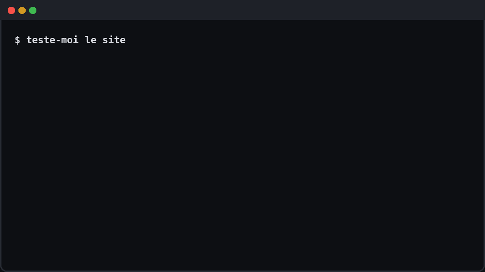
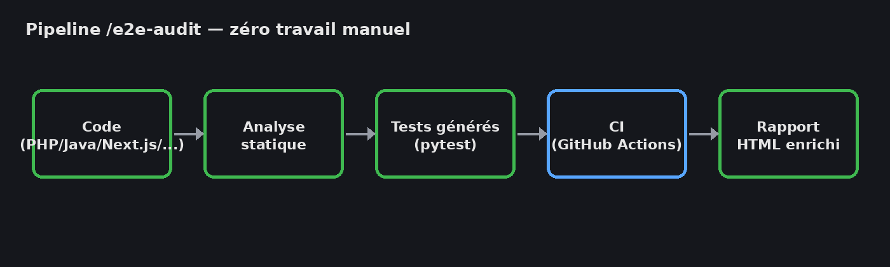
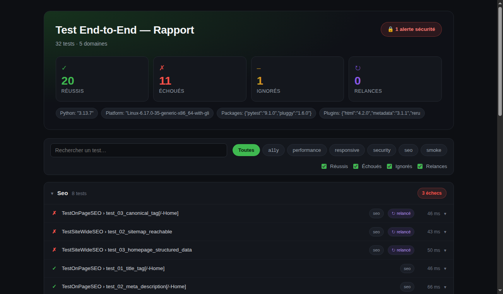

<p align="center"></p>

<p align="center"><b>C'est la révolution des tests end-to-end.</b></p>

<p align="center">Générateur de tests E2E zéro effort manuel — pytest + Selenium, n'importe quel langage backend, tout découvert depuis le code lui-même.</p>

<p align="center"></p>

---

## Le problème que ça résout

Écrire une suite de tests end-to-end correcte prend des jours : trouver toutes les routes, écrire les sélecteurs, gérer l'auth, penser au SEO, à la sécurité, à l'accessibilité, au responsive — et la maintenir à jour à chaque changement de code. La plupart des projets n'en ont juste pas, ou une poignée de tests qui datent d'il y a six mois.

`test-end-to-end` lit le code du projet (routes, formulaires, entités admin) et génère la suite à la place de l'humain : pytest + Selenium, structurée proprement, avec les checks qualité qui comptent vraiment (pas juste "la page charge"). Une commande, zéro saisie manuelle, et un rapport qui explique chaque échec au lieu de juste dire "assert failed".

## Comment ça marche

1. **Découverte** — analyse statique du code (pas de crawl live) : grep les routes selon le framework détecté (`composer.json` → PHP, `pom.xml` → Spring, `manage.py` → Django, `app/` → Next.js, etc.), extrait les formulaires et leurs champs, repère les entités admin.
2. **Génération** — remplit un template de tests éprouvé (structure validée sur une vraie suite de 300+ tests en prod) avec les vraies routes/sélecteurs trouvés. Jamais de placeholder laissé en plan.
3. **Exécution** — `pytest` + Selenium, navigateurs partagés par rôle (pas un par test) pour scaler à 1000+ tests sans exploser le temps de run.
4. **Rapport** — dashboard custom (pas le tableau pytest-html brut) : groupes par domaine, filtres par catégorie, recherche, chaque échec sécu/SEO explique le risque et le fix, screenshot cliquable en grand, bouton qui relance vraiment le test si le rapport tourne via le petit serveur local inclus.
5. **Idempotent** — relancer `/e2e-audit` plus tard ne réécrit pas ce qui existe déjà ; ça ajoute les nouvelles routes et signale ce qui semble périmé.

## Pour qui

Quiconque utilise Claude Code sur un projet web (peu importe le langage backend) et veut une vraie couverture E2E sans y passer une semaine : développeur solo, petite équipe sans QA dédiée, ou juste pour avoir un garde-fou avant chaque déploiement.

---

## Installation

**Étape 1** — ajouter la marketplace (attendre la confirmation avant de continuer) :

```
/plugin marketplace add https://github.com/Aronbfrt/test-end-to-end
```

**Étape 2** — installer le plugin :

```
/plugin install test-end-to-end@test-end-to-end
```

> **Note :** la forme courte `Aronbfrt/test-end-to-end` utilise SSH et échoue sans clé GitHub configurée. L'URL HTTPS complète fonctionne sans configuration supplémentaire.

## Commandes

| Commande | Action |
|---|---|
| `/e2e-init` | Setup guidé — copie le template, routes/forms remplis étape par étape |
| `/e2e-audit` | Audit automatique complet — découvre chaque route/form/entité par analyse statique, génère tests basiques + SEO + sécurité + accessibilité + performance + responsive, les lance, corrige les échecs en boucle. Zéro saisie manuelle. Idempotent : un re-run synchronise les nouvelles routes sans toucher aux tests déjà écrits à la main. |

Déclencheurs langage naturel (si mappés dans ton `CLAUDE.md`) : "teste-moi le site", "audit le site", "test complet" → `/e2e-audit`.

## Lancer les tests

```bash
pytest                  # headless (défaut, CI-safe)
pytest --headed         # Chrome visible — voir les tests s'exécuter en direct
pytest --headed -x      # visible + stop au premier échec
pytest -m smoke         # seulement les tests critiques
pytest tests/seo/       # un dossier
```

## Migration automatique des tests existants

Tu as déjà des tests ? `/e2e-audit` les détecte et les convertit automatiquement en Python/pytest avant de générer quoi que ce soit :

| Format source | Converti en |
|---|---|
| Jest / Vitest | `class TestX` + `assert` Python |
| Cypress | `driver.get()` + `find_element()` Selenium |
| Playwright | `driver.get()` + `find_element()` Selenium |
| WebdriverIO | `driver.get()` + `find_element()` Selenium |
| **Robot Framework** (`.robot`) | `def test_xxx()` pytest + Selenium |
| **Cucumber / Gherkin** (`.feature`) | Chaque `Scenario` → classe pytest |
| PHPUnit | `def test_xxx()` pytest |
| JUnit / TestNG (Java) | `def test_xxx()` pytest |
| NUnit / xUnit / MSTest (C#) | `def test_xxx()` pytest |
| RSpec / Minitest (Ruby) | `def test_xxx()` pytest |
| Go test (`*_test.go`) | `def test_xxx()` pytest |
| Selenium IDE (`.side`) | `driver.get()` + `find_element()` Selenium |

- Les sélecteurs CSS/XPath sont extraits dans `tests/pages/*.py` (jamais en dur dans le test)
- L'intention du test est préservée exactement — seule la syntaxe change
- Chaque test converti est marqué `# converted from <fichier_original>`
- Le fichier original est supprimé après conversion

## Auto-fix en direct

`/e2e-audit` ne s'arrête pas après la première run — il corrige les échecs et relance en boucle, **Chrome ouvert en visible** pour voir chaque test s'exécuter en direct :

1. Lance `pytest --headed` sur la suite complète
2. Pour chaque test qui échoue, analyse le `--tb=short` et corrige immédiatement :
   - Mauvais sélecteur → met à jour `tests/pages/*.py`
   - Mauvaise URL dans le test → corrige le path
   - Mauvaise config (`.env.test`, `BASE_URL`) → corrige et relance
3. Relance le test corrigé seul pour valider le fix
4. Recommence jusqu'à 3 fois au maximum
5. Ce qui reste rouge après 3 rounds = **vrai bug dans l'app** → reporté comme finding, jamais supprimé

Les tests sécu ne sont **jamais modifiés** — un échec sécu = vulnérabilité réelle, toujours signalé.

---

## Le pipeline

<p align="center"></p>

---

## 4 choses que personne d'autre ne fait dans un setup pytest+Selenium offline

- **🎬 Replay animé des échecs** — pas un screenshot du moment où ça plante, un GIF des dernières actions (clics + navigations) qui ont mené au crash. Capturé en silence, assemblé seulement si ça apporte une vraie info (pas de "replay" figé si la page n'a pas bougé).
- **👁 Régression visuelle** — chaque test compare son screenshot à une baseline, pass ou fail. Un test peut être 100% fonctionnellement vert et avoir quand même un bouton qui a bougé ou un header devenu invisible — aucun `assert` ne voit ça, ce mécanisme oui.
- **🎲 Détection de tests instables** — historique léger sur les derniers runs, flag les tests qui se contredisent d'une fois à l'autre. Le signal que `pytest-rerunfailures` masque en se contentant de réessayer.
- **🩹 Sélecteurs auto-réparants** — narrow et jamais silencieux : un seul repli (id↔name↔data-testid), jamais d'heuristique floue qui risquerait d'interagir avec le mauvais élément. Si ça répare, ça le crie dans le rapport.

## Ce que tu obtiens

- **Page Object Model** — sélecteurs dans `tests/pages/`, jamais en dur dans un test
- **Dossiers plats par domaine** — `tests/auth/`, `tests/admin/`, `tests/checkout/`... une feature = un endroit
- **Navigateurs session-scoped** — un navigateur par rôle pour toute la run, scale à 1000+ tests
- **SEO complet** — title/meta/canonical (+ https)/h1/hiérarchie de titres/alt/lang/viewport/Open Graph/noindex/structured data/robots.txt/sitemap.xml, chaque échec explique pourquoi ça compte
- **Sécurité complète, non-destructive** — fuite erreur SQL, échappement input réfléchi, headers sécu (CSP/HSTS/X-Frame-Options...), cookies (Secure/HttpOnly/SameSite), fuite de version serveur, open redirect, listing de répertoire, CORS permissif, chemins sensibles exposés, bannières debug, bypass auth admin, prix manipulable côté client. Jamais destructif, jamais contre la prod.
- **Accessibilité au-delà du scan générique** — lien d'évitement, labels de formulaire, landmarks ARIA, pièges aria-hidden, boutons sans nom accessible
- **Responsive complet** — débordement horizontal multi-breakpoints, cibles tactiles, images qui scalent, taille de police lisible sur mobile
- **Performance au-delà du chargement** — scripts bloquants, poids total de la page, taille du DOM, First Contentful Paint, compression gzip/brotli
- **Rapport HTML enrichi** — échecs avec screenshot/replay + erreurs console embarqués direct dans la ligne, thème sombre, colonnes Catégorie/Visuel/Stabilité/Sélecteur (sécu = badge rouge 🔒)
- **Zéro install** — `tests/run.sh` installe automatiquement les paquets pip manquants
- **N'importe quelle stack** — PHP, Java/Spring, Next.js, Django, Flask, Rails, Go, Rust, Elixir — la découverte de routes s'adapte selon le fichier marqueur (`composer.json`, `pom.xml`, `manage.py`...)

Voir `templates/e2e/README.md` pour la référence complète de structure une fois installé dans un projet.

---

## Le rapport

<p align="center"></p>

---

## Contributeurs

- [Aron Beaufort](https://github.com/Aronbfrt) — créateur & mainteneur

PR bienvenues — voir `templates/e2e/README.md` pour les conventions à suivre (Page Object Model, dossiers plats par domaine, messages d'assertion qui expliquent le pourquoi, pas juste le quoi).
