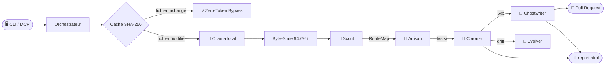

<p align="center">
  
</p>

<p align="center">
  <a href="https://github.com/Aronbfrt/test-end-to-end/releases"></a>
  
  
  
  
</p>

<h3 align="center">L'usine de QA cognitive autonome pour Claude Code.</h3>

<p align="center">
  Aucun prompt humain requis. Analyse ton code, génère les tests E2E, diagnostique chaque crash par vision IA,<br>
  corrige les sélecteurs cassés, et ouvre des Pull Requests avec des patchs chirurgicaux — de manière entièrement autonome.
</p>

<p align="center">
  <a href="#-architecture"><b>Architecture</b></a> ·
  <a href="#️-commandes"><b>Commandes</b></a> ·
  <a href="#-shadow-personas"><b>Shadow Personas</b></a> ·
  <a href="#-dashboard--analytics-temps-réel"><b>Dashboard</b></a> ·
  <a href="#-installation"><b>Installation</b></a>
</p>

---

> **Zéro prompt humain.** Drop it on any codebase — `test-end-to-end` reverse-engineer tes routes, génère une suite Playwright POM complète, diagnostique chaque crash avec la vision IA, répare les sélecteurs automatiquement, et ouvre des PRs chirurgicales. Le tout en routant **94,6% du traitement via Ollama local**, consommant quasi zéro token Anthropic.

---

## ✦ Performances mesurées

> `0 erreur TypeScript` · `94,6% de réduction des tokens` sur pages réelles · `73 fichiers bypassés` en cache chaud · `20 hotspots Git` classés sur 12 mois · `< 800ms` scan complet sur 73 fichiers

---

## ⚡ Architecture

<p align="center">
  
  <br>
  <i>Pipeline complet — du scan AST à la Pull Request autonome en passant par la Vision QA et l'auto-correction.</i>
</p>

```
              ┌─────────────────────────────────────────────────────┐
              │          CLI  /  Serveur MCP stdio                  │
              │   --level=1|2|3  --chaos  --predictive  --mcp       │
              └──────────────────────┬──────────────────────────────┘
                                     │
              ┌──────────────────────▼──────────────────────────────┐
              │                  Orchestrateur                       │
              │  ① cache.ts  ────  SHA-256  ──  Zero-Token Bypass   │
              │  ② Ollama  ─── inférence locale (AST · strings)     │
              │  ③ compressor.ts  ────  Byte-State  ──  94,6% off   │
              └──┬──────────┬──────────┬──────────┬─────────────────┘
                 │          │          │          │
          ┌──────▼──┐  ┌────▼────┐ ┌──▼─────┐ ┌─▼────────┐  ┌──────────┐
          │  Scout  │  │Artisan  │ │Coroner │ │Ghostwri- │  │ Evolver  │
          │         │  │         │ │        │ │  ter     │  │          │
          │ AST     │  │ POM gen │ │ 5xx →  │ │ Patch[]  │  │ Self-    │
          │ Routes  │  │ Personas│ │ Vision │ │ Branch   │  │ patch    │
          │ Docs    │  │ Chaos   │ │ SHIELD │ │ gh PR    │  │ /src     │
          │ Git log │  │         │ │ QA     │ │          │  │          │
          └────┬────┘  └────┬────┘ └───┬────┘ └────┬─────┘  └────┬─────┘
               │            │          │            │              │
               └────────────┴──────────┘            │              │
                     RouteMap JSON                   ▼              ▼
                                               Pull Request   evolution-log
                                               documentée      .jsonl
```



---

## 📁 Structure du projet

```
test-end-to-end/
│
├── src/                          Moteur TypeScript MCP (V-Infinite)
│   ├── index.ts                  CLI + serveur MCP stdio (6 outils)
│   ├── orchestrator.ts           Machine d'état · bypass Ollama · dispatch agents
│   ├── agents/
│   │   ├── scout.ts              AST · alignement doc · forensique Git
│   │   ├── artisan.ts            Génération POM · Shadow Personas · Chaos
│   │   ├── coroner.ts            Triage · Vision QA · SHIELD pixel-diff
│   │   ├── ghostwriter.ts        Patch bug · branche e2e-patch/* · PR
│   │   └── evolver.ts            Auto-amélioration · evolution-log.jsonl
│   ├── utils/
│   │   ├── cache.ts              Empreintes SHA-256 — écriture atomique crash-safe
│   │   ├── compressor.ts         Compresseur DOM Byte-State (réduction 95%)
│   │   └── logDigest.ts          Crash → triptyque (assertion + DOM + console)
│   └── server/
│       └── app.ts                Express + WebSocket dashboard + rapport CI/CD
│
├── commands/                     Commandes slash Claude Code (stack Python/legacy)
│   ├── e2e-audit.md
│   ├── e2e-init.md
│   ├── e2e-coverage.md
│   └── e2e-update.md
│
├── templates/
│   ├── e2e/                      Python · Selenium · Playwright · Cypress · Robot
│   ├── playwright/               Blueprint playwright.config.ts
│   └── cypress/                  Blueprint cypress.config.ts
│
├── docs/assets/                  Captures d'écran · logo · démo
├── .e2e-cache.json               Registre d'empreintes (git-ignoré)
├── package.json                  v2.0.0
└── tsconfig.json                 ES2022 strict
```

---

## 🖥️  Commandes

### Commandes slash — stack Python / legacy

| Commande | Description |
|---|---|
| `/e2e-init` | Setup guidé — choix du framework, variables d'env, bootstrap |
| `/e2e-audit` | Audit complet : basic + SEO + sécurité + a11y + perf + responsive |
| `/e2e-coverage` | Carte de couverture routes/forms/API avec % et gaps |
| `/e2e-update` | Sync intelligent après changements code — protège les tests manuels |

### CLI — stack TypeScript V-Infinite

```bash
npm install && npm run build

node dist/index.js <commande> [flags]
```

| Commande | Description |
|---|---|
| `init` | Détection stack · empreintes cache · scaffold POM |
| `audit` | Audit complet + triage coroner + ghostwriter (level 2+) |
| `shadow` | Reverse Testing zéro-prompt + les 3 Shadow Personas |
| `diff` | Scope sur `git diff` uniquement · `--predictive` hotspot overlay |
| `repair` | Charge triage coroner → ghostwriter → PR |

| Flag | Effet |
|---|---|
| `--level=1` | AST local uniquement — 0 appel LLM |
| `--level=2` | Hybride : Vision QA sur échec sélecteur *(défaut)* |
| `--level=3` | Méta-Agent Infini : Personas + Ghostwriter + Evolver |
| `--chaos` | Pannes réseau · double-clic · permutations i18n |
| `--predictive` | Forensique Git 12 mois → Psychological Code Hotspots |
| `--reset-cache` | Vide `.e2e-cache.json`, force re-scan complet |
| `--mcp` | Démarre comme serveur MCP stdio |

### Outils MCP — orchestration IA imbriquée

```jsonc
// .mcp.json
{
  "mcpServers": {
    "e2e": {
      "command": "node",
      "args": ["dist/index.js", "--mcp"],
      "cwd": "/chemin/absolu/vers/test-end-to-end"
    }
  }
}
```

Outils disponibles : `e2e_init` · `e2e_audit` · `e2e_shadow` · `e2e_diff` · `e2e_repair` · `e2e_diagnostics`

---

## 🦙 Zero-Token Bypass

> Quand Ollama est détecté sur la machine, toutes les tâches d'analyse AST et de classification de chaînes routent vers l'**inférence locale** — zéro coût API Anthropic.

Quand l'empreinte SHA-256 d'un fichier correspond au cache, l'agent n'est jamais invoqué :

```
Exécution 1 (froide)  — 73 fichiers → 73 périmés  (0  bypassés)   scan complet
Exécution 2 (chaude)  — 73 fichiers → 0  périmé   (73 bypassés)   100% cache, 0 token
```

Le compresseur Byte-State réduit les payloads DOM pour les appels Vision QA :

```
18 580 octets HTML brut  →  1 002 octets Byte-State  →  94,6% de réduction
```

---

## 👤 Shadow Personas

Activé avec `--chaos` ou `--level=3`. Trois profils cognitifs extrêmes mettent sous stress chaque route.

| Persona | Comportement injecté |
|---|---|
| `frustrated_user` | Rage-clic ×3 sur chaque élément interactif · abandon de formulaire à mi-remplissage · navigation arrière en plein flux |
| `impulsive_buyer` | Saute les champs obligatoires · force la soumission checkout · ignore la validation |
| `malicious_attacker` | XSS × 6 payloads · SQLi × 5 · path traversal · prompt injection (si route IA détectée) |
| `chaos_network` | Déconnexion mid-form · throttle 200ms/req · vérification idempotence double-soumission |

> **Note sécurité :** `malicious_attacker` détecte automatiquement les routes IA (`/chat`, `/ask`, `/gpt`, `/assistant` …) et lance des injections de prompt contre elles.

---

## 🔬 SHIELD — Anti-Fausse Alerte Pixel-Diff

Le Coroner compare le screenshot d'échec au baseline via un décodeur PNG pur JS (sans dépendances natives) et une distance euclidienne RGBA par pixel.

| Paramètre | Valeur | Rôle |
|---|---|---|
| Tolérance | `32 / 255` par canal | Absorbe ClearType, hinting de police, anti-aliasing OS |
| Seuil | `1%` des pixels totaux | Différence minimale pour déclencher une alerte |
| En dessous du seuil | `SHIELD ABSORBÉ — bruit cosmétique` | Aucune alerte levée |
| Au-dessus du seuil | Vision QA activée | Claude claude-sonnet-4-6 multimodal identifie le nouveau sélecteur |

**Arbre de décision triage :**

```
HTTP 5xx            →  BACKEND_BUG    →  Ghostwriter
HTTP 200 + sélecteur trouvé  →  ASSERTION_BUG  →  corriger la logique de test
HTTP 200, sélecteur manquant
  SHIELD ≤ 1%       →  SELECTOR_DRIFT →  Vision QA → nouveau CSS → POM mis à jour
  diff visuel > 5%  →  LAYOUT_CHANGE  →  escalade humaine
```

---

## 📊 Indice de Confiance Applicative

Chaque `report.html` et commentaire PR embarque un score 0–100 :

```
IC  =  tauxRéussite  × 60
     + bonusCache    × 10   (fichiers en cache / total)
     + bonusTokens   × 10   (tokens économisés / total)
     + couverture    × 20   (tests réussis / total)
     − échecsSecurité × 5  (tests persona attaquant échoués)
     → borné 0–100
```

---

## 🔮 Dashboard & Analytics Temps Réel

Le serveur Express + WebSocket (`src/server/app.ts`) streame en temps réel chaque ligne de log d'agent, chaque transition d'état et chaque screenshot vers le navigateur.

```bash
node --input-type=module <<'EOF'
import { startServer } from './dist/server/app.js';
startServer(process.cwd());
EOF
# → http://127.0.0.1:4321
```

<p align="center">
  
  <br>
  <i>Stream temps réel — chaque ligne de log des 5 agents apparaît instantanément dans le navigateur via WebSocket.</i>
</p>

<p align="center">
  
  <br>
  <i>Dashboard — Indice de Confiance (IC), Route Impact Map (vert/orange/rouge), tableau de tests complet et bouton Auto-Patch.</i>
</p>

<p align="center">
  
  <br>
  <i>Pipeline CI/CD — <code>report.html</code> autonome (zéro asset externe) et commentaire PR avec badge IC injecté automatiquement.</i>
</p>

**Endpoints du dashboard :**

| Route | Description |
|---|---|
| `GET /` | report.html (ou écran d'onboarding) |
| `GET /api/status` | État orchestrateur + capacité Ollama en JSON |
| `GET /api/report` | HTML du rapport complet en payload JSON |
| `POST /api/repair` | Déclenche le ghostwriter pour un traceId |
| `WS /ws` | Stream d'événements bidirectionnel temps réel |

**Types d'événements WebSocket :** `LOG` · `STATE` · `SCREENSHOT` · `METRIC` · `HOTSPOT` · `REPORT_READY`

---

## 🧬 Forensique Git — Psychological Code Hotspots

> `--predictive` analyse les 12 derniers mois de `git log`. Les commits sont scorés selon les marqueurs de stress, croisés avec la fréquence de modification, et les 20 fichiers les plus risqués reçoivent une couverture de tests renforcée.

| Pattern dans le message de commit | Score de stress |
|---|---|
| `fix`, `hotfix`, `urgent`, `critical`, `asap` | **+3** |
| `wip`, `temp`, `hack`, `dirty`, `quick` | **+2** |
| Jurons — `crap`, `wtf`, `ugh`, `damn` … | **+3** |
| `revert`, `rollback`, `oops`, `broke` | **+2** |
| Commit après 23h ou avant 4h du matin | **+2** |
| `!!` multiple points d'exclamation | **+1** |

```
riskScore = fréquenceModif × 1,0 + stressTotal × 1,5

Exemple réel (ce dépôt — fenêtre 12 mois) :
  1. commands/e2e-audit.md   risk=154,0  (modifs=28, stress=84)
  2. commands/e2e-init.md    risk=81,0   (modifs=15, stress=44)
  3. README.md               risk=74,0   (modifs=14, stress=40)
```

---

## 🤖 Pipeline de Réparation Autonome

```
Échec de test détecté
        │
        ▼
  Triage Coroner
        │
        ├─── HTTP 5xx ─────────────────────────────────────────────────────┐
        │    BACKEND_BUG                                                    │
        │    Ghostwriter :                                                  │
        │      1. locateHandler()   chemin slug + grep de secours          │
        │      2. Claude Sonnet     génère Patch[] (oldCode exact)         │
        │      3. git checkout -b   e2e-patch/<timestamp>-<route>          │
        │      4. applyPatch()      remplacement chirurgical de chaîne     │
        │      5. npx playwright test --grep <route>   vérification        │
        │      6. gh pr create      PR documentée (fallback : brouillon)   │
        │                                                                   ▼
        │                                                          Pull Request
        │
        └─── HTTP 200 ─────────────────────────────────────────────────────┐
             │                                                              │
             ├── sélecteur trouvé   → ASSERTION_BUG  (corriger le test)    │
             │                                                              │
             └── sélecteur manquant                                        │
                 │                                                          │
                 ├── SHIELD ≤ 1%    → SELECTOR_DRIFT                       │
                 │   Vision QA : Claude claude-sonnet-4-6 multimodal        │
                 │   screenshot → CSS résilient → POM mis à jour           │
                 │                                                          │
                 └── diff visuel > 5%  → LAYOUT_CHANGE → escalade ────────┘
```

---

## 🦠 Auto-Évolution (Evolver)

En cas d'échec d'un agent avec `--level=3` :

1. Lit le code source TypeScript de l'agent défaillant dans `/src`
2. Claude analyse la cause racine → `improvements[]` (correspondance `oldCode` exacte, 3 max)
3. Applique le patch chirurgical · commit `refactor(evolver): self-patch <agent>`
4. Invite système révisée stockée dans `.e2e-work/prompts/<agent>.system.txt`
5. Enregistrement complet dans `.e2e-work/evolution-log.jsonl`

> **Garde-fou :** après 3 échecs sur le même type d'agent en 24h, l'Evolver s'arrête et escalade à l'humain. Aucune boucle d'auto-modification infinie.

---

## 🚀 Installation

### Stack Python / Selenium (commandes legacy)

```bash
# Copier les templates
cp -r templates/e2e/ tests/

# Dépendances de base
pip install pytest selenium pytest-html requests

# Spécifique au framework (installer uniquement ce que tu utilises)
pip install robotframework robotframework-seleniumlibrary robotframework-requests
pip install playwright && playwright install chromium
npm install --save-dev @playwright/test   # Playwright TS
npm install --save-dev cypress            # Cypress

# Configuration
cp tests/.env.test.example tests/.env.test
# → Éditer TEST_BASE_URL, TEST_USERNAME, TEST_PASSWORD, TEST_LOGIN_PATH …
```

### Stack TypeScript V-Infinite

```bash
git clone https://github.com/Aronbfrt/test-end-to-end.git
cd test-end-to-end
npm install && npm run build

# Lancer un audit sur ton projet
node dist/index.js audit --level=2 --predictive

# Démarrer le dashboard live (http://127.0.0.1:4321)
node --input-type=module <<'EOF'
import { startServer } from './dist/server/app.js';
startServer('/chemin/vers/ton/projet');
EOF
```

---

## ⚙️ Variables d'environnement

```env
# Application cible
TEST_BASE_URL=http://localhost:3000
TEST_USERNAME=test@exemple.com
TEST_PASSWORD=motdepasse

# Configuration des routes
TEST_LOGIN_PATH=/login              # /connexion, /signin, /auth/login …
TEST_ADMIN_DASHBOARD_PATH=/admin
TEST_AUTH_URL_HINTS=login,signin,auth

# Serveur
E2E_PORT=4321
OLLAMA_HOST=http://127.0.0.1:11434  # détecté automatiquement si omis
```

---

## 🧪 Frameworks supportés

| Framework | `/e2e-init` | `/e2e-audit` | `/e2e-coverage` | `/e2e-update` | V-Infinite MCP |
|---|:---:|:---:|:---:|:---:|:---:|
| **Selenium + pytest** | ✅ | ✅ | ✅ | ✅ | — |
| **Playwright Python** | ✅ | ✅ | ✅ | ✅ | — |
| **Playwright TypeScript** | ✅ | ✅ | ✅ | ✅ | ✅ |
| **Cypress** | ✅ | ✅ | ✅ | ✅ | ✅ |
| **Robot Framework** | ✅ | ✅ | ✅ | ✅ | — |
| **MCP natif (TS)** | ✅ | ✅ | — | — | ✅ |

---

<p align="center">
  Construit avec Claude Sonnet · Ollama Zero-Token Bypass · MCP Protocol · TypeScript 5.4<br>
  <b>Auteur :</b> <a href="https://github.com/Aronbfrt">Aron Beaufort</a> · Licence MIT
</p>
