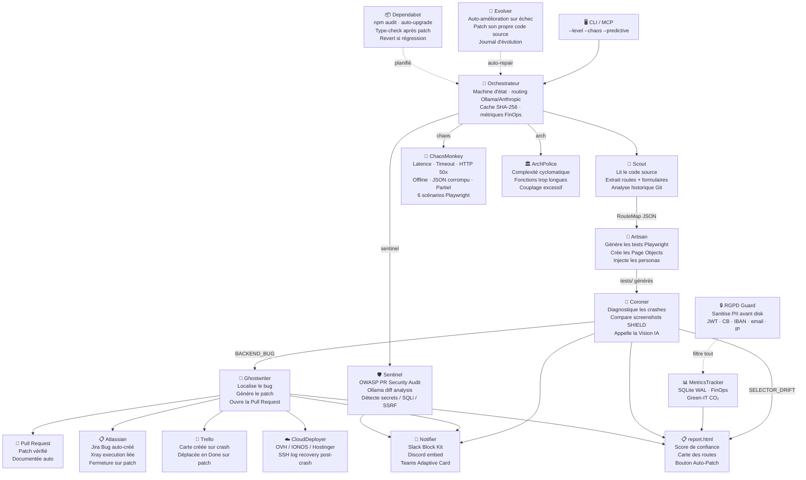

<p align="center">
  
</p>

<p align="center">
  <a href="https://github.com/Aronbfrt/test-end-to-end/releases"></a>
  
  
  
  
</p>

<h3 align="center">L'usine de QA cognitive autonome pour Claude Code — 13 agents spécialisés.</h3>

<p align="center">
  Tu pointes le plugin sur n'importe quel projet. Il lit ton code source, comprend tes routes et tes formulaires,<br>
  génère une batterie de tests E2E complets, diagnostique chaque crash avec l'IA,<br>
  audite la sécurité OWASP des Pull Requests, analyse l'architecture de ton code, scanne les dépendances npm vulnérables,<br>
  et ouvre des Pull Requests avec des patchs chirurgicaux. <b>Zéro configuration manuelle. Zéro prompt humain à écrire.</b>
</p>

<p align="center">
  <a href="#-prérequis"><b>Prérequis</b></a> ·
  <a href="#-installation-du-plugin"><b>Installation</b></a> ·
  <a href="#-démarrage-rapide"><b>Démarrage rapide</b></a> ·
  <a href="#️-commandes-en-détail"><b>Commandes</b></a> ·
  <a href="#-architecture"><b>Architecture</b></a> ·
  <a href="#-intégrations"><b>Intégrations</b></a> ·
  <a href="#-dashboard"><b>Dashboard</b></a>
</p>

---

## ✅ Prérequis

Avant d'installer le plugin, vérifie que tu as ces outils sur ta machine. Sans eux, certaines fonctionnalités ne marcheront pas.

### Obligatoires

| Outil | Version minimum | Pourquoi c'est nécessaire | Installation |
|---|---|---|---|
| **Node.js** | 18.0+ | Fait tourner le moteur TypeScript du plugin | [nodejs.org](https://nodejs.org) |
| **npm** | 9.0+ | Installé automatiquement avec Node.js | — |
| **Git** | 2.x | Requis pour l'analyse Git forensique et la création de branches automatiques | [git-scm.com](https://git-scm.com) |
| **Claude Code** | latest | L'environnement depuis lequel tu lances les commandes slash | `npm install -g @anthropic-ai/claude-code` |

### Fortement recommandé — Ollama (économie de tokens IA)

**Ollama** est un logiciel gratuit qui fait tourner des modèles IA directement sur ta machine.

**Ce qui est toujours local (zéro token) :**
- Génération de tests — `artisan` produit tous les fichiers `.spec.ts` par templates, sans aucun appel API
- Analyse AST — `scout` lit et classe ton code entièrement en local
- Carte de couverture (`coverage`) et synchronisation (`update`) — 100% locaux

**Ce qu'Ollama améliore :**
- Classification des messages de commit pour détecter le stress Git — sans Ollama, le plugin utilise une analyse par marqueurs regex (100% local, moins précise) ; avec Ollama, un LLM local affine le scoring

**Ce qui utilise toujours l'API Claude (tokens payants) :**
- `coroner` — analyse de crash + Vision IA sur sélecteurs cassés (`--level=2+`)
- `ghostwriter` — génération de patches chirurgicaux (`--level=3` / `repair`)
- `evolver` — auto-amélioration sur erreur fatale (`--level=3` uniquement)

```bash
# macOS — installeur graphique recommandé
# → https://ollama.com/download/mac

# Linux — une seule commande
curl -fsSL https://ollama.com/install.sh | sh

# Windows — installeur graphique
# → https://ollama.com/download/windows

# Après installation — choisir le modèle selon ta RAM :

# ✅ Recommandé — machines avec 8 Go de RAM ou moins (rapide, léger, 2 Go)
ollama pull llama3.2:3b

# 🚀 Performances supérieures — machines avec 16 Go de RAM ou plus (meilleure qualité, 4.7 Go)
ollama pull llama3.1:8b

# Vérifier que le modèle est bien installé
ollama list
# → tu dois voir "llama3.2:3b" ou "llama3.1:8b" dans la liste
```

> **Quel modèle choisir ?** Le plugin utilise Ollama pour classifier des messages de commit et détecter des anomalies de sélecteur CSS — des tâches simples. `llama3.2:3b` est parfaitement suffisant et démarre en 2 secondes. `llama3.1:8b` donne de meilleurs résultats sur les projets complexes (commits ambigus, frameworks rares) mais consomme ~5x plus de RAM. Si tu as les deux installés, le plugin choisit automatiquement le premier détecté par `ollama list`.

> **Ollama n'est pas obligatoire.** Si tu ne l'installes pas, le plugin utilise l'API Claude normalement — ça marche pareil, mais consomme des tokens pour chaque analyse.

### Optionnel — GitHub CLI (pour la création automatique de PRs)

Si tu veux que le plugin ouvre des Pull Requests automatiquement quand il trouve un bug, il faut `gh` installé et connecté à GitHub.

```bash
# macOS (Homebrew)
brew install gh

# Ubuntu / Debian
sudo apt install gh

# Linux — autres distributions (Fedora, Arch, etc.)
# → https://github.com/cli/cli/blob/trunk/docs/install_linux.md

# Windows
winget install --id GitHub.cli
# ou télécharger l'installeur sur https://cli.github.com

# Connexion à GitHub (macOS / Linux / Windows — même commande)
gh auth login
```

### Optionnel — Playwright (pour exécuter les tests générés)

Le plugin *génère* les tests Playwright. Pour les *exécuter* localement :

```bash
# macOS / Linux / Windows — mêmes commandes
npm install -g @playwright/test
playwright install chromium

# Vérifier l'installation
playwright --version
```

> **Windows :** lance PowerShell en tant qu'administrateur (clic droit → "Exécuter en tant qu'administrateur") avant de lancer `playwright install chromium` — requis pour installer les binaires browser.

---

## 📦 Installation du plugin

### Étape 1 — Installer le plugin dans Claude Code

```bash
# macOS / Linux / Windows — mêmes commandes
# Étape 1a : enregistrer le dépôt comme marketplace
claude plugin marketplace add https://github.com/Aronbfrt/test-end-to-end.git

# Étape 1b : installer le plugin depuis cette marketplace
claude plugin install test-end-to-end@test-end-to-end
```

Ces deux commandes téléchargent le plugin et l'activent dans Claude Code comme commandes slash (`/e2e-init`, `/e2e-audit`, etc.). Redémarre Claude Code après pour que les nouvelles commandes apparaissent.

### Étape 2 — Installer les dépendances du moteur TypeScript

```bash
# macOS / Linux
cd ~/.claude/plugins/marketplaces/test-end-to-end

# Windows (PowerShell)
cd "$env:USERPROFILE\.claude\plugins\marketplaces\test-end-to-end"

# Windows (Invite de commandes / CMD)
cd %USERPROFILE%\.claude\plugins\marketplaces\test-end-to-end
```

```bash
# Installer les dépendances Node.js (macOS / Linux / Windows — même commande)
npm install

# Compiler le moteur TypeScript en JavaScript
npm run build
```

> **Pourquoi cette étape ?** Le moteur V-Infinite est écrit en TypeScript. GitHub stocke le code source, mais Node.js a besoin du JavaScript compilé pour l'exécuter. Cette étape est à faire **une seule fois** après l'installation, puis à refaire uniquement si tu mets à jour le plugin.

### Étape 3 — Vérifier que tout fonctionne

> **Important :** cette commande doit être lancée depuis le dossier du plugin (celui où tu es allé à l'étape 2). Si tu as ouvert un nouveau terminal, refais le `cd` de l'étape 2 avant.

```bash
node dist/index.js --help
```

Tu dois voir ceci :

```
test-end-to-end V-Infinite 2.0.0 — Autonomous QA Engine

USAGE
  node dist/index.js <command> [targetPath] [flags]

COMMANDS
  init        Initialise le projet cible : détecte le stack, amorce le cache,
              génère la config Playwright.
              Ex: node dist/index.js init
                  node dist/index.js init /mon/projet

  audit       Audit E2E complet : scan AST → génération tests → triage → rapport.
              Ex: node dist/index.js audit
                  node dist/index.js audit --level=2 --predictive

  shadow      Zero-prompt Reverse Testing + Shadow Personas (Frustrated / Attacker /
              Chaos / Impulsive). Fonctionne sans qu'on décrive une seule fonctionnalité.
              Ex: node dist/index.js shadow --level=3 --chaos

  diff        Cible le scan sur les fichiers modifiés (git diff HEAD + staged).
              --predictive ajoute les hotspots Git des 12 derniers mois.
              Ex: node dist/index.js diff
                  node dist/index.js diff --predictive --level=2

  repair      Active Ghostwriter pour patcher un bug confirmé par le Coroner.
              Charge automatiquement le dernier triage (.e2e-work/*.triage.json).
              Ex: node dist/index.js repair
                  node dist/index.js repair --trace=run-1718542800000

  coverage    Carte de couverture : routes + forms vs fichiers de test existants.
              Génère .e2e-work/coverage.html et coverage.json.
              Ex: node dist/index.js coverage
                  node dist/index.js coverage --detail

  update      Sync intelligent après changements de code.
              Compare routes actuelles vs snapshot (.e2e-work/last-routes.json),
              génère uniquement les tests manquants. Protège les tests manuels.
              Ex: node dist/index.js update
                  node dist/index.js update --dry-run

  sentinel    Audit sécurité OWASP sur les Pull Requests GitHub.
              Analyse le diff de la PR avec Ollama (local) ou regex statique.
              Détecte : secrets en dur, SQLi, SSRF, eval(), XSS, IDOR, RCE.
              Ex: node dist/index.js sentinel --pr=42
                  node dist/index.js sentinel --pr=42 --repo=owner/repo

  arch        Analyse l'architecture du code source TypeScript/JavaScript.
              Détecte fonctions trop longues, complexité cyclomatique élevée,
              fichiers trop gros, couplage excessif (imports).
              Ex: node dist/index.js arch
                  node dist/index.js arch /chemin/vers/ton/projet

  chaos       Injecte des scénarios de chaos réseau sur les routes existantes.
              Génère des specs Playwright : LATENCY, TIMEOUT, ERROR_50x, OFFLINE,
              CORRUPT (JSON malformé), PARTIAL (réponse tronquée).
              Ex: node dist/index.js chaos
                  node dist/index.js chaos --port=8080

FLAGS
  --level=1         Déterministe local — AST pur, sans LLM
  --level=2         Hybride cognitif — Vision IA sur sélecteur cassé (défaut)
  --level=3         Meta-Agent Infinite — Shadow Personas + Ghostwriter + Evolver
  --chaos           Inject scénarios de faute réseau / double-submit / i18n
  --predictive      Git forensics 12 mois → hotspot ranking
  --dry-run         Affiche ce qui serait fait sans écrire de fichier (update)
  --detail          Sortie détaillée par route (coverage)
  --trace=<id>      Charge un triage spécifique par son identifiant (repair)
  --pr=<number>     Numéro de Pull Request GitHub à auditer (sentinel)
  --repo=<owner/r>  Dépôt cible (sentinel, si différent du courant)
  --port=<number>   Port du serveur local à tester (chaos, défaut : 3000)
  --reset-cache     Vide le cache d'empreintes SHA-256
  --mcp             Démarre en mode serveur MCP (stdin/stdout JSON-RPC)

DASHBOARD
  node dist/server/start.js     → http://127.0.0.1:4321

MCP (.mcp.json)
  { "mcpServers": { "e2e": { "command": "node",
    "args": ["/chemin/dist/index.js", "--mcp"] } } }
```

Si tu vois une erreur :
- `Cannot find module` → `npm run build` n'a pas été lancé (étape 2), ou tu n'es pas dans le bon dossier
- `node: command not found` → Node.js n'est pas installé ou pas dans le PATH → [nodejs.org](https://nodejs.org)
- Autre erreur → vérifie que Node.js 18+ est bien installé : `node --version`

---

## 🚀 Démarrage rapide

Voici comment utiliser le plugin sur ton projet en 2 minutes.

### Utilisation via les commandes slash (le plus simple)

Ouvre Claude Code sur ton projet, puis tape directement dans le chat :

```
/e2e-init
```

Claude va t'accompagner pas à pas pour configurer les tests sur ton projet. Il détecte automatiquement ton framework (Next.js, Express, Laravel, Rails, Django…) et génère la configuration adaptée.

### Utilisation via le CLI (contrôle total)

```bash
# macOS / Linux
node ~/.claude/plugins/marketplaces/test-end-to-end/dist/index.js audit /chemin/vers/ton/projet --level=2

# Exemple macOS / Linux (projet dans ~/dev/mon-app)
node ~/.claude/plugins/marketplaces/test-end-to-end/dist/index.js audit ~/dev/mon-app --level=2 --predictive

# Windows (PowerShell)
node "$env:USERPROFILE\.claude\plugins\marketplaces\test-end-to-end\dist\index.js" audit C:\chemin\vers\ton\projet --level=2
```

### Résultat attendu

Après la première exécution, deux dossiers apparaissent à la racine de ton projet :

**`tests/`** — tests générés puis exécutés par le moteur
- `tests/<route>/base.spec.ts` — tests fonctionnels par route (généré à tous les niveaux)
- `tests/<route>/persona_frustrated.spec.ts` — Shadow Persona utilisateur frustré (`--level=3` ou `shadow`)
- `tests/<route>/persona_attacker.spec.ts` — Shadow Persona attaquant malveillant (`--level=3` ou `shadow`)
- `tests/<route>/persona_impulsive.spec.ts` — Shadow Persona acheteur impulsif (`--level=3` ou `shadow`)
- `tests/<route>/chaos_network.spec.ts` — injection de fautes réseau (`--chaos` ou `--level=3`, uniquement pour les routes avec formulaire)
- `tests/report.html` — rapport de confiance (score IC 0–100, résultats par route, verdicts)

**`.e2e-work/`** — données internes du moteur (ne pas modifier manuellement)
- `latest.log` — log complet de ce que l'IA a découvert (visible dans le dashboard → onglet Logs, téléchargeable via le bouton ⬇)
- `*.triage.json` — résultats de triage Coroner (générés à `--level=2+`, utilisés par `repair`)
- `coverage.html` / `coverage.json` — carte de couverture (générée par `coverage`)
- `last-routes.json` — snapshot routes pour le mode `update`
- `pr-*.md` — brouillon Pull Request (créé si `gh` n'est pas installé)

---

## 🖥️  Commandes en détail

Le plugin offre deux types d'interface : les **commandes slash** (pour une utilisation guidée dans Claude Code) et le **CLI** (pour une utilisation directe dans le terminal avec plus de contrôle).

> **Important :** Les flags comme `--level=2` ou `--predictive` ne s'utilisent **jamais seuls**. Ils se combinent toujours avec une commande. Exemples corrects et incorrects :
> ```bash
> # ❌ Ne fonctionne pas — manque la commande
> node dist/index.js --level=2
>
> # ✅ Correct — commande + flags
> node dist/index.js audit --level=2 --predictive
> ```

---

### `/e2e-init` — Initialisation guidée du projet

**Ce que ça fait :** C'est la première commande à lancer sur un nouveau projet. Elle analyse ton code source pour détecter automatiquement ta stack technique (Next.js, Express, Nuxt, Laravel, Django, Rails…), puis génère tous les fichiers de configuration nécessaires pour les tests E2E et crée des exemples de tests pour chaque route détectée.

**Quand l'utiliser :** Une seule fois, au début, quand tu mets en place les tests sur un projet qui n'en a pas encore.

```bash
# Via Claude Code (recommandé — mode guidé interactif)
/e2e-init

# Via CLI — initialise le projet dans le dossier courant
node dist/index.js init

# Via CLI — initialise un projet spécifique
node dist/index.js init /chemin/vers/ton/projet
```

**Résultat :** Un dossier `tests/` est créé avec une structure Page Object Model (POM), un fichier de configuration Playwright adapté à ton projet, et des tests de base prêts à être exécutés.

---

### `/e2e-audit` — Audit E2E complet automatique

**Ce que ça fait :** C'est la commande principale du plugin. Elle scanne ton code source (AST), détecte les routes et formulaires, puis génère automatiquement quatre types de tests :
- **Fonctionnels** — chaque route répond en 200, aucune erreur console, les formulaires ne retournent pas de 5xx
- **Sécurité** — payloads XSS, injection SQL, traversée de répertoires, injection de prompts (si feature IA détectée)
- **Shadow Personas** — utilisateur frustré (clics rapides, abandon), attaquant malveillant, acheteur impulsif (`--level=3`)
- **Chaos réseau** — double-submit, timeout, erreurs réseau injectées (`--chaos` ou `--level=3`)

À la fin, elle génère un rapport HTML avec un **score de confiance** de 0 à 100.

**Quand l'utiliser :** Avant chaque déploiement, après une grosse modification du code, ou quand tu veux avoir une vue d'ensemble de l'état de santé de ton application.

```bash
# Via Claude Code
/e2e-audit

# Via CLI — niveau 1 : analyse locale uniquement, sans IA (le plus rapide, 0 token)
node dist/index.js audit --level=1

# Via CLI — niveau 2 : analyse + Vision IA sur les sélecteurs cassés (recommandé)
node dist/index.js audit --level=2

# Via CLI — niveau 2 + forensique Git (détecte les fichiers historiquement risqués)
node dist/index.js audit --level=2 --predictive

# Via CLI — niveau 3 : audit complet avec personas cyber-attaquants + auto-patch PR
node dist/index.js audit --level=3 --chaos --predictive
```

**Les 3 niveaux en détail :**

| Niveau | Ce qui est activé | Coût IA | Temps estimé |
|---|---|---|---|
| `--level=1` | Analyse AST locale + génération de tests + exécution Playwright. Aucun appel IA. | 0 token | 1–3 min |
| `--level=2` *(défaut)* | Tout le niveau 1 + Vision IA pour diagnostiquer les sélecteurs cassés et suggérer un remplacement + triage intelligent des crashes | Quelques appels | 1–3 min |
| `--level=3` | Tout le niveau 2 + les 3 Shadow Personas (frustrated_user, impulsive_buyer, malicious_attacker) + création automatique de PR de correction + auto-évolution du plugin sur erreur fatale | Plus d'appels | 3–10 min |

---

### `/e2e-coverage` — Carte de couverture des tests

**Ce que ça fait :** Analyse ton codebase et compare les routes et formulaires existants dans ton code aux tests E2E actuellement en place. Te donne une carte visuelle précise : "tu as 47 routes, 31 sont couvertes (66%), il manque ces 16-là". Identifie aussi les formulaires non testés.

**Quand l'utiliser :** Quand tu veux savoir où sont tes angles morts en matière de tests, ou pour justifier auprès d'une équipe le niveau de couverture actuel.

```bash
# Via Claude Code
/e2e-coverage

# Via CLI — génère le rapport de couverture
node dist/index.js coverage

# Rapport avec détail par route et formulaire (fichiers de test correspondants)
node dist/index.js coverage --detail
```

---

### `/e2e-update` — Mise à jour intelligente des tests

**Ce que ça fait :** Quand tu ajoutes de nouvelles fonctionnalités à ton application, tes tests existants deviennent incomplets. Cette commande détecte automatiquement ce qui a changé depuis le dernier audit (nouvelles routes, formulaires modifiés, endpoints ajoutés) et génère uniquement les tests manquants — **sans jamais écraser les tests que tu as écrits manuellement**.

**Quand l'utiliser :** Après avoir ajouté une nouvelle page, un nouveau formulaire, ou un nouvel endpoint API à ton application.

```bash
# Via Claude Code
/e2e-update

# Via CLI — détecte les changements et met à jour les tests
node dist/index.js update

# Avec prévisualisation de ce qui va changer (sans modifier les fichiers)
node dist/index.js update --dry-run
```

---

### `shadow` — Reverse Testing avec personas extrêmes

**Ce que ça fait :** Plutôt que de tester "le comportement normal d'un utilisateur", cette commande génère des tests qui simulent des comportements extrêmes : un utilisateur frustré qui clique frénétiquement partout, un acheteur impulsif qui essaie de passer une commande sans remplir les champs obligatoires, et un attaquant malveillant qui tente des injections XSS, SQL et des traversées de répertoires. C'est l'équivalent d'un pentest automatisé intégré à tes tests E2E.

**Quand l'utiliser :** Avant un lancement public, ou sur des fonctionnalités critiques (paiement, authentification, upload de fichiers).

```bash
# Via CLI — active les 3 personas sur toutes les routes
node dist/index.js shadow --level=2

# Avec simulation de pannes réseau en plus (connexion coupée en plein milieu d'un formulaire…)
node dist/index.js shadow --level=2 --chaos

# Version complète : personas + réseau + auto-patch si bugs trouvés
node dist/index.js shadow --level=3 --chaos
```

---

### `diff` — Tests ciblés sur les fichiers modifiés

**Ce que ça fait :** Au lieu d'analyser tout ton projet à chaque fois (ce qui peut être long sur un gros projet), cette commande regarde uniquement les fichiers que tu as modifiés depuis ton dernier commit Git. Elle génère ou met à jour des tests uniquement pour ce qui a changé. Avec `--predictive`, elle ajoute aussi les fichiers historiquement risqués (ceux qui ont le plus souvent causé des bugs dans le passé selon l'historique Git).

**Quand l'utiliser :** Dans ton workflow quotidien, avant chaque commit, pour tester rapidement ce que tu viens de modifier.

```bash
# Via CLI — teste uniquement les fichiers modifiés depuis le dernier commit
node dist/index.js diff

# Avec overlay des fichiers historiquement risqués
node dist/index.js diff --predictive

# Avec niveau 2 (Vision IA activée)
node dist/index.js diff --level=2 --predictive
```

---

### `repair` — Réparation autonome d'un bug diagnostiqué

**Ce que ça fait :** Si un audit précédent a détecté et diagnostiqué un bug (via le Coroner), cette commande prend le rapport de triage, localise le fichier source concerné, génère un patch via Claude, l'applique, vérifie que les tests passent, et crée une Pull Request documentée sur GitHub. Tout ça sans que tu aies à toucher une ligne de code.

**Quand l'utiliser :** Après un audit de niveau 2 ou 3 qui a identifié un `BACKEND_BUG`. Le plugin t'indique quand un bug est réparable automatiquement.

```bash
# Via CLI — charge le dernier triage et tente la réparation
node dist/index.js repair

# Sur un triage spécifique (identifiant visible dans report.html)
node dist/index.js repair --trace=run-1718542800000
```

---

### `sentinel` — Audit sécurité OWASP sur une Pull Request

**Ce que ça fait :** Récupère le diff d'une Pull Request GitHub et l'analyse à la recherche de 9 classes de vulnérabilités OWASP : secrets hardcodés (mots de passe, tokens, clés API), injection SQL, SSRF, `eval()`/`exec()`, XSS, accès fichier non-filtré (`readFileSync`), IDOR, injection de commande shell, et RCE. L'analyse utilise Ollama en priorité (100% local, 0 token) ; si Ollama n'est pas disponible, elle bascule sur un moteur regex statique intégré.

**Quand l'utiliser :** Avant de merger une PR en production, automatiquement en CI/CD, ou à la demande sur une PR dont tu veux vérifier la sécurité.

```bash
# Auditer la PR #42 du dépôt courant
node dist/index.js sentinel --pr=42

# Auditer une PR sur un dépôt spécifique
node dist/index.js sentinel --pr=42 --repo=owner/mon-projet

# Via Claude Code — Claude appelle Sentinel automatiquement
/e2e-audit   # Sentinel s'active sur chaque PR créée par Ghostwriter
```

**Résultat :** Un tableau de résultats avec pour chaque finding : la sévérité (`HIGH` / `MEDIUM` / `LOW`), la ligne du fichier concernée, la description du problème, et une suggestion de correction. Un résumé est posté en notification Slack/Discord si configuré.

**Prérequis :** `GITHUB_TOKEN` dans `.env` + `gh` CLI installé. Si l'un des deux est absent, Sentinel désactive l'analyse de PR mais continue sur le diff local.

---

### `arch` — Police de l'architecture du code

**Ce que ça fait :** Scanne tous les fichiers TypeScript et JavaScript de ton projet et mesure 4 métriques architecturales :
- **Longueur des fonctions** — toute fonction de plus de 80 lignes est signalée
- **Complexité cyclomatique** — compte les branches (`if/else/for/while/case/?? /&&/||/catch`) — seuil à 10
- **Taille des fichiers** — tout fichier de plus de 500 lignes est signalé
- **Couplage par imports** — tout fichier avec plus de 15 imports est signalé

Le score d'architecture est calculé de 0 à 100 : `100 − (pénalités / fichiers × 10)`. Un rapport Markdown complet est généré dans `.e2e-work/arch-report.md`.

**Quand l'utiliser :** En revue de code périodique, avant un refactoring, ou pour justifier une dette technique auprès de l'équipe.

```bash
# Analyser le projet courant
node dist/index.js arch

# Analyser un projet spécifique
node dist/index.js arch /chemin/vers/ton/projet

# Via Claude Code — Claude peut lire le rapport via le dashboard
# GET http://127.0.0.1:4321/api/arch
```

**Résultat :** `.e2e-work/arch-report.json` (données brutes) + `.e2e-work/arch-report.md` (rapport lisible avec liste des violations par fichier et suggestions de découpage).

---

### `chaos` — Injection de chaos réseau

**Ce que ça fait :** Prend toutes les routes détectées dans ton projet et génère des fichiers de tests Playwright spécialisés dans la simulation de pannes réseau. Pour chaque route (jusqu'à 10), il génère 6 specs :

| Scénario | Ce qui est simulé |
|---|---|
| `LATENCY` | Délai de 3 à 5 secondes sur toutes les requêtes API — vérifie que la page n'affiche pas d'erreur |
| `TIMEOUT` | Toutes les requêtes API avortées (`ETIMEDOUT`) — vérifie l'absence de crash JavaScript |
| `ERROR_50x` | Les API retournent HTTP 500 / 503 — vérifie qu'aucune stack trace n'est exposée |
| `OFFLINE` | Toutes les requêtes réseau bloquées — vérifie que la page n'est pas blanche |
| `CORRUPT` | Les API retournent du JSON syntaxiquement invalide — vérifie l'absence d'erreur non catchée |
| `PARTIAL` | Les API retournent une réponse JSON tronquée — vérifie l'absence d'erreur visible |

**Quand l'utiliser :** Avant un lancement public, lors d'une revue de résilience, ou pour vérifier que ton frontend gère correctement les erreurs réseau.

```bash
# Générer les specs chaos pour le projet courant (port 3000)
node dist/index.js chaos

# Avec un port personnalisé
node dist/index.js chaos --port=8080

# Via Claude Code
/e2e-audit   # le flag --chaos active ChaosMonkey dans le pipeline standard
```

---

### Intégration MCP — Donner le contrôle à Claude directement

**Ce que c'est :** En mode MCP (Model Context Protocol), le plugin se transforme en "serveur d'outils" que Claude peut appeler directement, sans que tu aies besoin de taper des commandes. Claude peut décider lui-même de lancer un audit, regarder la couverture, ou réparer un bug, en réponse à tes questions en langage naturel.

**Comment l'activer :** Crée un fichier `.mcp.json` **à la racine de TON projet** (pas dans le dossier du plugin), avec ce contenu :

```jsonc
// .mcp.json — à créer à la racine de ton projet applicatif
{
  "mcpServers": {
    "e2e": {
      "command": "node",
      "args": ["dist/index.js", "--mcp"],
      "cwd": "/chemin/absolu/vers/test-end-to-end"
    }
  }
}
```

> Remplace `/chemin/absolu/vers/test-end-to-end` par le chemin réel vers le dossier du plugin sur ta machine. Exemple : `/Users/aron/.claude/plugins/marketplaces/test-end-to-end`

Une fois configuré, Claude peut utiliser ces 11 outils automatiquement :

| Outil MCP | Équivalent CLI | Ce que Claude peut faire |
|---|---|---|
| `e2e_init` | `init` | Initialiser les tests sur ton projet |
| `e2e_audit` | `audit` | Lancer un audit complet |
| `e2e_shadow` | `shadow` | Tester les personas extrêmes |
| `e2e_diff` | `diff` | Tester uniquement les fichiers modifiés |
| `e2e_repair` | `repair` | Réparer un bug diagnostiqué |
| `e2e_coverage` | `coverage` | Carte de couverture routes + forms |
| `e2e_update` | `update` | Sync tests après changements de code |
| `e2e_sentinel` | `sentinel` | Auditer la sécurité OWASP d'une PR GitHub |
| `e2e_arch` | `arch` | Analyser la complexité architecturale du code |
| `e2e_chaos` | `chaos` | Générer des specs de chaos réseau |
| `e2e_diagnostics` | — | Voir l'état du plugin (cache, Ollama, état) |

---

## ⚡ Architecture

Le plugin est organisé en **13 agents et modules spécialisés**, orchestrés par un cerveau central.



**Le flux principal (audit) :**

1. **Scout** — lit ton projet, identifie toutes les pages, routes et formulaires. Phase de "cartographie".
2. **Artisan** — prend cette carte et génère les fichiers de tests Playwright correspondants.
3. **Coroner** — après exécution, analyse les échecs. Distingue un crash serveur (500) d'un sélecteur HTML renommé (SHIELD).
4. **Ghostwriter** — quand un bug serveur est confirmé, localise le code responsable, génère un correctif, ouvre une PR.
5. **Evolver** — si un agent échoue de manière répétée, lit son propre code source et se corrige (max 3 tentatives/24h).

**Les 8 agents supplémentaires (V-Infinite) :**

6. **Sentinel** — analyse le diff de chaque PR GitHub via Ollama (ou regex OWASP en fallback), détecte 9 patterns de vulnérabilité.
7. **ChaosMonkey** — génère des specs Playwright qui interceptent le réseau via `page.route()` pour simuler 6 types de panne.
8. **ArchPolice** — scanne tous les fichiers TypeScript/JS et flagge la complexité cyclomatique élevée, les fichiers trop longs, le couplage excessif.
9. **Dependabot** — lance `npm audit`, tente d'upgrader les packages vulnérables, fait un type-check, et reverte si ça casse.
10. **Atlassian** — crée automatiquement un ticket Jira Bug + une exécution Xray sur chaque crash, les ferme sur patch.
11. **Trello** — crée une carte dans la colonne "À faire" sur crash, la déplace dans "Terminé" sur patch.
12. **CloudDeployer** — déclenche un déploiement (OVH/IONOS/Hostinger) après chaque patch réussi, récupère les logs serveur via SSH.
13. **Notifier** — envoie une notification fire-and-forget à Slack, Discord et/ou Teams à chaque événement (crash, patch, déploiement).

---

---

## 🔌 Intégrations

Toutes les intégrations sont **opt-in** : il suffit d'ajouter les variables correspondantes dans un fichier `.env` à la racine du plugin. Si une variable est absente, le module est silencieusement désactivé — il ne plante jamais.

---

### 💬 ChatOps — Slack, Discord, Teams

Le Notifier envoie une notification instantanée à chaque événement clé : crash détecté, patch généré, déploiement déclenché, vulnérabilité Sentinel, violation ArchPolice.

**Format des notifications :**
- **Slack** : Block Kit structuré avec champs colorés (rouge = crash, vert = patch, bleu = info)
- **Discord** : Embed avec titre, description, couleur et footer horodaté
- **Microsoft Teams** : Adaptive Card avec titre et corps de texte

Les trois peuvent être actifs simultanément — les notifications partent en parallèle (fire-and-forget, sans bloquer le pipeline).

```bash
# .env — ajouter les webhooks souhaités
SLACK_WEBHOOK_URL=https://hooks.slack.com/services/T.../B.../...
DISCORD_WEBHOOK_URL=https://discord.com/api/webhooks/.../...
TEAMS_WEBHOOK_URL=https://xxx.webhook.office.com/webhookb2/...
```

> **Comment créer un webhook Slack :** [api.slack.com/messaging/webhooks](https://api.slack.com/messaging/webhooks)  
> **Comment créer un webhook Discord :** Paramètres du canal → Intégrations → Webhooks

---

### 📋 Atlassian — Jira + Xray

Quand le Coroner détecte un crash serveur (`BACKEND_BUG`), le module Atlassian crée automatiquement :
1. Un ticket **Jira Bug** dans le projet configuré, avec le message d'erreur, la route, le traceId et le timestamp
2. Une **exécution Xray** liée au ticket, pour tracer le résultat du test automatiquement dans ton outil de QA

Quand Ghostwriter ouvre une PR de correction, le ticket est automatiquement passé en statut **Résolu** et l'exécution Xray est marquée **PASS**.

```bash
# .env — toutes les 4 variables sont requises pour activer le module
JIRA_URL=https://monprojet.atlassian.net
JIRA_TOKEN=ATATT3xxxxxxxxxxxxxxxxxxx        # Token API Atlassian
JIRA_USER_EMAIL=dev@monprojet.com
JIRA_PROJECT_KEY=QA                         # Clé du projet Jira cible
```

> **Créer un token Atlassian :** [id.atlassian.com/manage-profile/security/api-tokens](https://id.atlassian.com/manage-profile/security/api-tokens)

---

### 📌 Trello

Alternative à Jira pour les équipes qui utilisent Trello. Sur chaque crash, une carte est créée dans la colonne "À faire" avec le titre du bug, la route concernée et le traceId dans la description. Sur patch, la carte est automatiquement déplacée dans la colonne "Terminé".

```bash
# .env — toutes les 4 variables sont requises
TRELLO_API_KEY=...          # Clé API sur https://trello.com/app-key
TRELLO_TOKEN=...            # Token d'autorisation (scope read,write)
TRELLO_TODO_LIST_ID=...     # ID de la liste "À faire" (visible dans l'URL Trello)
TRELLO_DONE_LIST_ID=...     # ID de la liste "Terminé"
```

---

### ☁️ Déploiement automatique — OVH, IONOS, Hostinger

Après chaque patch réussi (Ghostwriter a ouvert une PR qui passe les tests), le CloudDeployer peut déclencher automatiquement un déploiement sur ton hébergeur.

**Trois hébergeurs supportés :**

**OVH Cloud** — utilise l'API REST OVHcloud v1 avec signature HMAC-SHA1 authentifiée :
```bash
OVH_APP_KEY=xxxxx
OVH_APP_SECRET=xxxxx
OVH_CONSUMER_KEY=xxxxx
OVH_PROJECT_ID=xxxxx        # ID projet Public Cloud OVH
OVH_SERVICE_NAME=xxxxx      # Nom du service (instance ou cluster)
```
> **Créer des credentials OVH :** [api.ovh.com/createToken](https://api.ovh.com/createToken/index.cgi)

**IONOS** — déclenche un `workflow_dispatch` GitHub Actions sur la branche de déploiement :
```bash
IONOS_GITHUB_REPO=owner/repo
IONOS_GITHUB_TOKEN=ghp_xxxxxxx
IONOS_WORKFLOW_FILE=deploy.yml      # Fichier workflow dans .github/workflows/
IONOS_DEPLOY_BRANCH=main
```

**Hostinger** — appel POST sur un webhook de déploiement :
```bash
HOSTINGER_DEPLOY_WEBHOOK_URL=https://xxx.hostinger.com/deploy/webhook/...
```

**Récupération des logs serveur post-crash (SSH)**

Si un crash est détecté en environnement de staging ou production, CloudDeployer peut se connecter en SSH pour récupérer les 100 dernières lignes des logs nginx, pm2 et systemd node :
```bash
SSH_HOST=1.2.3.4
SSH_PORT=22
SSH_USER=ubuntu
SSH_PRIVATE_KEY=/home/user/.ssh/id_rsa
```
Les logs récupérés sont affichés dans le dashboard (onglet Triage) et inclus dans le rapport Coroner.

---

### 💳 StripeMock — Simulation webhooks Stripe (test uniquement)

Le module StripeMock permet de simuler des événements Stripe webhook dans un environnement de test. Il génère des payloads signés HMAC-SHA256 authentiques et les envoie à ton endpoint webhook local pour tester ta gestion des événements sans toucher à l'API Stripe réelle.

**8 types de carte simulés :**

| Carte | Comportement |
|---|---|
| `visa_success` | Paiement réussi immédiatement |
| `declined_generic` | Refus générique |
| `auth_required` | Authentification requise avant capture |
| `three_d_secure` | Flow 3D Secure complet |
| `insufficient_funds` | Fonds insuffisants |
| `expired_card` | Carte expirée |
| `lost_card` | Carte signalée volée |
| `network_error` | Erreur réseau simulée |

**9 types d'événements simulés :**
`payment_intent.succeeded`, `payment_intent.payment_failed`, `payment_intent.requires_action`, `charge.refunded`, `customer.subscription.created`, `customer.subscription.deleted`, `invoice.payment_succeeded`, `invoice.payment_failed`, `checkout.session.completed`

```bash
# .env — secret webhook depuis le dashboard Stripe en mode TEST uniquement
STRIPE_WEBHOOK_SECRET=whsec_xxxxxxxxxxxxxxxxxxxxxxxx
```

> **Important :** Ce module est conçu pour l'environnement de test uniquement. Il ne fait jamais d'appels à l'API Stripe réelle. Le secret webhook doit être celui du mode test Stripe (préfixe `whsec_`).

---

## 💡 Zero-Token Bypass — Comment le plugin évite de dépenser des tokens inutilement

### Le problème qu'il résout

Chaque fois qu'un outil IA analyse du code, il envoie ce code à un modèle de langage (Claude, GPT…) qui consomme des "tokens" — l'unité de mesure qui détermine le coût. Si tu as un projet de 200 fichiers et que tu lances un audit tous les jours, tu pourrais dépenser beaucoup de tokens pour analyser des fichiers qui n'ont pas changé depuis la veille.

### La solution : une empreinte digitale par fichier

À chaque scan, le plugin calcule une **empreinte numérique unique** (SHA-256) pour chaque fichier — comme une signature qui change si et seulement si le contenu du fichier change. Ces empreintes sont stockées dans `.e2e-cache.json`.

Lors du scan suivant, le plugin compare les empreintes actuelles avec celles sauvegardées :
- **Empreinte identique** → fichier non modifié → **aucun agent activé, 0 token dépensé**
- **Empreinte différente** → fichier modifié → l'agent est activé pour analyser les changements

```
1er scan (rien en cache) :  73 fichiers → 73 analysés  → coût normal
2e scan (cache chaud)    :  73 fichiers → 0 analysé    → 0 token dépensé ✓
Après modification code  :  73 fichiers → 3 analysés   → seulement 3 fichiers modifiés
```

### Et Ollama dans tout ça ?

**Ollama** est un logiciel qui fait tourner des modèles IA sur ta propre machine, gratuitement. Le plugin détecte automatiquement si Ollama est installé et actif. Quand c'est le cas :

- Les tâches "légères" (analyse AST, classification de sélecteurs, résumé de code) partent vers Ollama → **gratuit, local, rapide**
- Les tâches "lourdes" (Vision QA sur screenshots, génération de patchs complexes) partent vers Claude (Anthropic) → **seulement quand nécessaire**

Sans Ollama : tout passe par Anthropic.  
Avec Ollama : environ 94% du traitement se fait en local, gratuitement.

### La compression Byte-State (réduction supplémentaire)

Quand une page HTML doit quand même être envoyée à un modèle IA (par exemple pour analyser un crash), le plugin la compresse en 3 passes avant de l'envoyer :

1. **Purge** — supprime tout ce qui n'est pas utile pour comprendre la structure : balises `<script>`, `<style>`, attributs `on*` (onclick, onmouseover…), data-URIs, éléments cachés (`aria-hidden=true`)
2. **Fusion** — regroupe les éléments identiques répétés : si tu as 50 lignes `<li class="item">`, elles deviennent `li.item × 50`
3. **Sérialisation** — encode la structure restante sous forme compacte avec des clés hex à 4 caractères

**Résultat mesuré :** 18 580 octets → 1 002 octets (réduction de 94,6%)

---

## 🔒 RGPD Guard — Protection automatique des données personnelles

Toutes les données écrites sur disque par le plugin (logs, rapports de triage, rapports d'architecture, rapports Dependabot) passent d'abord par le RGPD Guard. Il sanitise automatiquement les catégories de données personnelles sensibles avant qu'elles ne soient écrites dans `.e2e-work/`.

**Données détectées et masquées :**

| Type de donnée | Pattern détecté | Remplacé par |
|---|---|---|
| JWT tokens | `eyJ...` (base64 header JWT) | `[JWT_REDACTED]` |
| Clés API / Bearer tokens | `Bearer xxxxx`, `sk-xxx`, `ghp_xxx`… | `[API_KEY_REDACTED]` |
| Numéros de carte bancaire | 13–19 chiffres avec séparateurs | `[CB_REDACTED]` |
| IBAN | `FR76...`, `DE89...`, etc. | `[IBAN_REDACTED]` |
| Adresses email | `x@x.x` | `[EMAIL_REDACTED]` |
| Numéros de téléphone | formats FR, US, international | `[PHONE_REDACTED]` |
| Adresses IP | IPv4 et IPv6 | `[IP_REDACTED]` |

La sanitisation est appliquée **avant** chaque écriture sur disque. Les données en mémoire (utilisées par les agents pendant l'exécution) ne sont pas modifiées — seules les écritures persistantes sont filtrées.

---

## 📦 Dependabot — Audit et mise à jour des dépendances npm

Le module Dependabot intégré analyse les vulnérabilités dans les dépendances npm de ton projet et tente de les corriger automatiquement, sans quitter le pipeline.

**Comment ça fonctionne :**

1. Lance `npm audit --json` sur le projet cible
2. Filtre les vulnérabilités selon la sévérité minimale configurée (`DEPENDABOT_MIN_SEVERITY`, défaut : `high`)
3. Pour chaque package vulnérable, tente un `npm install package@latest`
4. Si la version latest est un **major bump** (ex : 2.x → 3.x), vérifie que `tsc --noEmit` passe toujours
5. Si le type-check échoue, reverte automatiquement à la version précédente (`npm install package@ancienne-version`)
6. Génère un rapport complet dans `.e2e-work/dependabot-report.json`

```bash
# .env — sévérité minimale pour déclencher une tentative de correctif
DEPENDABOT_MIN_SEVERITY=high   # critical | high | moderate | low
```

**Résultat :** `.e2e-work/dependabot-report.json` avec pour chaque package : sévérité, version actuelle, version installée, statut (`patched` / `reverted` / `skipped`), et le message d'erreur si le type-check a échoué. Le rapport est accessible via `GET /api/dependabot` sur le dashboard.

---

## 🏛️ ArchPolice — Police de l'architecture

ArchPolice analyse statiquement l'ensemble de ton codebase TypeScript et JavaScript pour détecter les dérives architecturales qui rendent le code difficile à maintenir.

**4 métriques mesurées :**

| Métrique | Seuil | Impact |
|---|---|---|
| Longueur de fonction | > 80 lignes | Difficile à tester et à comprendre |
| Complexité cyclomatique | > 10 branches | Trop de chemins d'exécution possibles |
| Taille de fichier | > 500 lignes | Responsabilité trop large, fort couplage probable |
| Nombre d'imports | > 15 | Couplage excessif, dépendance difficile à tracer |

**Score d'architecture :**
```
Score = 100 − (nombre_de_violations / nombre_de_fichiers_analysés × 10)
→ borné entre 0 et 100
```

**Interprétation du score :**
- **80–100** : Architecture saine. Peu ou pas de violations.
- **60–79** : Quelques fichiers à refactorer en priorité.
- **40–59** : Dette technique visible. Recommandé : découper les fichiers les plus longs.
- **< 40** : Architecture dégradée. Le refactoring est urgent.

**Ce que ArchPolice génère :**
- `.e2e-work/arch-report.json` — données brutes par fichier (violations, score)
- `.e2e-work/arch-report.md` — rapport Markdown lisible avec liste des violations triées par sévérité

---

## 💰 FinOps & Green-IT

Le MetricsTracker enregistre automatiquement les statistiques de chaque run dans une base SQLite locale (`.e2e-work/storage.sqlite`, WAL mode).

**FinOps — suivi des économies de tokens :**

Chaque fichier analysé par le Zero-Token Bypass (SHA-256 cache) est compté. Les tokens évités sont convertis en économie financière estimée basée sur le tarif GPT-4o (`$0.000005 / token en entrée`).

```
Économie estimée = tokens_évités × $0.000005
```

**Green-IT — empreinte carbone :**

Les tokens évités sont également convertis en CO₂ économisé, en utilisant une estimation issue des données de consommation des datacenters IA :

```
CO₂ économisé = tokens_évités × 0,00198 g
```

**Accessible via :**
- Dashboard → onglet Métriques (score IC, tokens économisés, CO₂, coût évité)
- `GET /api/metrics` → données JSON brutes (stats cumulées + dernier run)
- `GET /api/runs` → historique des 10 derniers audits (date, durée, score IC)

---

## 🔮 Dashboard — Interface temps réel

Le dashboard est une interface web qui s'ouvre dans ton navigateur pendant l'exécution d'un audit. Elle affiche en temps réel chaque action des agents, les captures d'écran comparatives, et le score final.

```bash
# Démarrer le dashboard (port 4321 par défaut)
node dist/server/start.js

# Sur un projet spécifique
node dist/server/start.js /chemin/vers/ton/projet

# Port personnalisé
E2E_PORT=4444 node dist/server/start.js

# Ouvrir dans le navigateur
open http://127.0.0.1:4321
```

<p align="center">
  
  <br>
  <i>Vue d'ensemble — IC ring, métriques, aperçu routes, hotspots Git forensics, table complète des tests.</i>
</p>

<p align="center">
  
  <br>
  <i>Onglet Routes — chaque route cliquable pour révéler ses tests, durée moyenne, badge PASS/FAIL/WARN.</i>
</p>

<p align="center">
  
  <br>
  <i>Onglet Personas — 4 profils (Frustrated, Attacker, Chaos, Impulsive) avec stats pass/fail et tests par profil.</i>
</p>

<p align="center">
  
  <br>
  <i>Onglet Triage — verdict par route en échec (SELECTOR_DRIFT ou SECURITY_BREACH), analyse SHIELD, bouton Auto-Patch.</i>
</p>

**Fonctionnalités du dashboard :**

| Fonctionnalité | Description |
|---|---|
| Log temps réel | Chaque ligne d'action des 5 agents apparaît instantanément |
| Carte des routes | Chaque route colorée en vert (OK), orange (warning), rouge (crash) |
| Score de confiance | Indice calculé en direct de 0 à 100 |
| Comparaison screenshots | Vue côte à côte avant/après pour les changements visuels |
| Bouton Auto-Patch | Lance le Ghostwriter directement depuis l'interface |

**Endpoints disponibles :**

| Route | Description |
|---|---|
| `GET /` | Page principale du dashboard |
| `GET /api/status` | État de l'orchestrateur + capacité Ollama en JSON |
| `GET /api/report` | Rapport complet au format JSON |
| `GET /api/metrics` | Métriques FinOps + Green-IT (tokens économisés, CO₂, coût) |
| `GET /api/runs` | Historique des derniers audits (date, durée, score IC) |
| `GET /api/triages` | Résultats des derniers triages Coroner |
| `GET /api/arch` | Rapport ArchPolice (violations par fichier, score architecture) |
| `GET /api/dependabot` | Rapport Dependabot (vulnérabilités npm, patches tentés) |
| `POST /api/repair` | Déclenche une réparation pour un `traceId` donné |
| `WS /ws` | Connexion WebSocket pour le flux d'événements temps réel |

---

## 👤 Shadow Personas — Tester les comportements extrêmes

### Pourquoi tester des comportements "anormaux" ?

Un test classique vérifie que l'utilisateur "parfait" — celui qui remplit tous les champs correctement, clique au bon endroit, attend que la page charge — obtient le résultat attendu. Mais en production, les vrais utilisateurs ne se comportent pas comme ça. Et les attaquants non plus.

Les Shadow Personas sont des profils de comportement extrêmes qui génèrent des tests réalistes pour des situations difficiles.

### Les 4 personas

**`frustrated_user` — L'utilisateur frustré**

Simule quelqu'un qui s'énerve parce que la page est lente ou peu claire. Tests générés : clics frénétiques rapides sur les boutons (×3 en moins de 500ms), abandon de formulaire à mi-chemin et retour en arrière, soumission répétée du même formulaire, navigation via le bouton "Précédent" du navigateur en plein milieu d'un checkout.

**`impulsive_buyer` — L'acheteur impulsif**

Simule quelqu'un qui veut aller vite et qui ignore les consignes. Tests générés : tentative de soumission d'un formulaire avec des champs obligatoires vides, bypass des étapes de validation, passage direct à la page de paiement sans passer par le panier.

**`malicious_attacker` — L'attaquant malveillant**

Simule une tentative d'intrusion. Tests générés :
- **XSS (6 payloads)** : tentatives d'injection de code JavaScript dans les champs de formulaire
- **Injection SQL (5 payloads)** : tentatives de manipulation de la base de données via les inputs
- **Path Traversal (3 payloads)** : tentatives d'accès à des fichiers système via les URLs
- **Prompt Injection** : si le plugin détecte une route IA (`/chat`, `/ask`, `/assistant`…), il tente des attaques spécifiques aux LLM

**`chaos_network` — Le réseau instable**

Simule une connexion internet de mauvaise qualité. Tests générés : coupure de connexion en plein milieu d'un envoi de formulaire, throttling à 200ms par requête (simulation 3G faible), double-clic sur le bouton "Valider" pour tester l'idempotence (le serveur traite-t-il la commande deux fois ?).

### Comment activer les personas

```bash
# Activer les 4 personas sur toutes les routes détectées
node dist/index.js shadow --level=2

# Ajouter aussi la simulation réseau instable
node dist/index.js shadow --level=2 --chaos

# Version maximale : personas + réseau + correction automatique des bugs trouvés
node dist/index.js shadow --level=3 --chaos

# Ou via Claude Code
/e2e-audit   # puis répondre "oui" quand Claude propose d'activer les personas
```

---

## 🔬 SHIELD — Pourquoi un test de sélecteur échoue ≠ un vrai bug

### Le problème des faux positifs

Un test E2E comme `expect(page.locator('.btn-submit')).toBeVisible()` peut échouer pour deux raisons très différentes :

1. **Le bouton n'existe vraiment plus** — c'est un vrai bug, il faut alerter
2. **Le développeur a renommé la classe CSS** de `.btn-submit` en `.btn-submit-primary` — ce n'est pas un bug, juste un changement de style

Sans SHIELD, les deux cas déclenchent la même alerte rouge, ce qui génère des faux positifs épuisants.

### Comment SHIELD fonctionne

Quand un sélecteur ne se trouve plus, le Coroner prend deux screenshots (avant le test / après l'échec) et les compare pixel par pixel. Chaque pixel est mesuré en distance euclidienne RGBA (rouge + vert + bleu + transparence).

- **Tolérance par canal :** `32/255` — absorbe les micro-différences dues à l'anti-aliasing des polices, au rendu ClearType de Windows, ou aux différences entre OS
- **Seuil de déclenchement :** `1% des pixels doivent être différents` pour considérer qu'il y a un vrai changement visuel

| Résultat de la comparaison | Verdict | Action |
|---|---|---|
| Moins de 1% de pixels différents | `SHIELD ABSORBÉ — bruit cosmétique` | Aucune alerte. Le sélecteur a juste été renommé → Vision QA trouve le nouveau nom |
| Plus de 5% de pixels différents | `VRAI CHANGEMENT VISUEL` | Alerte réelle. L'interface a changé significativement |

**Quand SHIELD ne suffit pas :** la Vision QA prend le relais — Claude analyse le screenshot et propose un nouveau sélecteur CSS résistant aux renommages.

---

## 🧬 Forensique Git — Trouver les fichiers les plus risqués

### Le principe

Tous les fichiers d'un projet ne méritent pas la même attention. Un fichier qui a été modifié 50 fois en 12 mois, avec des commits intitulés "hotfix urgent", "wtf ça marche pas", "revert du revert"… est statistiquement plus susceptible de causer des bugs qu'un fichier stable qui n'a pas changé depuis 6 mois.

Avec `--predictive`, le plugin analyse les 12 derniers mois de `git log` et calcule un **score de risque** pour chaque fichier.

### Comment le score est calculé

```
score_risque = fréquence_modification × 1.0 + score_stress × 1.5
```

Le score de stress est calculé en cherchant des mots-clés dans les messages de commits :

| Mots dans les commits | Score de stress ajouté |
|---|---|
| `fix`, `hotfix`, `urgent`, `emergency`, `critical`, `asap`, `prod bug` | +3 |
| `wip`, `temp`, `temporary`, `hack`, `dirty`, `quick`, `kludge`, `no time`, `just ship`, `ship it` | +2 |
| Jurons : `crap`, `damn`, `shit`, `wtf`, `ugh`, `argh`, `ffs`, `stupid` | +3 |
| `revert`, `rollback`, `undo`, `oops`, `broke`, `broken` | +2 |
| Commit entre 23h et 4h du matin | +2 |
| `!!` (ponctuation d'excitation/panique) | +1 |

Les 20 fichiers avec le score le plus élevé (top 20 retournés par le Scout) reçoivent une couverture de tests plus dense — plus de variations, plus de cas limites.

**Exemple réel sur ce dépôt :**
```
1. commands/e2e-audit.md   risque=154   (modifs=28, stress=84)
2. commands/e2e-init.md    risque=81    (modifs=15, stress=44)
3. README.md               risque=74    (modifs=14, stress=40)
```

---

## 📊 Score de Confiance Applicative

Après chaque audit, un score de 0 à 100 est calculé et affiché dans `report.html` et dans les commentaires de PR automatiques.

```
Score = taux_réussite_tests × 60   (tests passés / tests totaux)
      + bonus_cache         × 10   (fichiers non modifiés / total — économie réalisée)
      + bonus_tokens        × 10   (tokens économisés via Ollama / total estimé)
      + couverture_routes   × 20   (routes avec ≥1 PASS / routes totales uniques)
      − échecs_sécurité     × 5    (tests persona "attaquant" échoués)
      → résultat borné entre 0 et 100
```

**Interprétation :**
- **80–100** : Excellent. Le projet est bien couvert, sûr, et économique.
- **60–79** : Bon. Quelques gaps de couverture ou alertes sécurité mineures.
- **40–59** : Attention. Des routes importantes ne sont pas testées ou des tests de sécurité échouent.
- **< 40** : Critique. Problèmes significatifs à traiter avant mise en production.

---

## 🤖 Pipeline de Réparation Autonome

Quand un crash est diagnostiqué comme un bug serveur (`BACKEND_BUG`), le pipeline de réparation se déclenche automatiquement en 6 étapes :

```
Test échoue avec HTTP 5xx
        │
        ▼
  1. LOCALISATION
     Ghostwriter cherche le fichier source de la route concernée
     (par slug d'URL + grep de secours sur le projet)
        │
        ▼
  2. GÉNÉRATION DU PATCH
     Claude Sonnet reçoit le code source compressé + le rapport de crash
     → produit un tableau Patch[] avec l'ancien code exact et le nouveau
        │
        ▼
  3. BRANCHE GIT
     git checkout -b e2e-patch/<timestamp>-<nom-route>
     Le patch est appliqué sur une branche séparée pour ne pas casser main
        │
        ▼
  4. VÉRIFICATION
     npx playwright test --grep <nom-route>
     Le patch n'est soumis que si les tests passent
        │
        ▼
  5. PULL REQUEST
     gh pr create → PR documentée avec description du bug + explication du fix
     (si gh n'est pas installé → brouillon .md créé dans .e2e-work/)
        │
        ▼
  6. RAPPORT
     Le score de confiance est mis à jour dans report.html
```

---

## 🦠 Auto-Évolution (Evolver)

### Ce que c'est

Si un agent du plugin plante de manière répétée (par exemple, le Scout ne reconnaît pas un nouveau framework, ou le Coroner échoue à décoder un format de screenshot), l'Evolver prend le relais. Il lit le code source TypeScript de l'agent défaillant, l'envoie à Claude avec le log d'erreur, reçoit un patch suggéré, l'applique, et commit le correctif — **le plugin se répare lui-même**.

### Garde-fous

- Maximum **3 tentatives par agent en 24h** — au-delà, l'Evolver s'arrête et escalade à l'humain
- Les améliorations sont toujours sur l'`oldCode` exact (correspondance verbatim requise) — pas de réécriture sauvage
- Chaque intervention est enregistrée dans `.e2e-work/evolution-log.jsonl` pour traçabilité

---

## 📁 Structure du projet

```
test-end-to-end/
│
├── src/                          Moteur TypeScript (V-Infinite)
│   ├── index.ts                  Point d'entrée CLI (11 commandes) + serveur MCP stdio (11 outils)
│   ├── orchestrator.ts           Machine d'état · bypass Ollama · dispatch · métriques SQLite
│   ├── agents/
│   │   ├── scout.ts              Lecture AST · alignement doc · Git forensique
│   │   ├── artisan.ts            Génération POM · Shadow Personas · Chaos
│   │   ├── coroner.ts            Triage crashes · Vision QA · SHIELD
│   │   ├── ghostwriter.ts        Patch bug · branche e2e-patch/* · PR
│   │   ├── evolver.ts            Auto-amélioration · evolution-log.jsonl
│   │   ├── sentinel.ts           OWASP PR audit · Ollama diff analysis · 9 patterns
│   │   ├── chaosMonkey.ts        6 scénarios Playwright · page.route() interception
│   │   ├── archPolice.ts         Complexité cyclomatique · longueur · couplage · score 0-100
│   │   └── dependabot.ts         npm audit · auto-upgrade · type-check · revert
│   ├── integrations/
│   │   ├── atlassian.ts          Jira Bug + Xray execution · Basic Auth Atlassian
│   │   ├── trello.ts             Carte crash/patch · API Trello
│   │   └── cloudDeployer.ts      OVH HMAC-SHA1 · IONOS workflow_dispatch · Hostinger · SSH logs
│   ├── utils/
│   │   ├── cache.ts              Empreintes SHA-256 — écriture atomique
│   │   ├── compressor.ts         Compresseur DOM Byte-State (95% réduction)
│   │   ├── logDigest.ts          Crash → triptyque (assertion + DOM + console)
│   │   ├── notifier.ts           Slack Block Kit · Discord embed · Teams Adaptive Card
│   │   ├── metricsTracker.ts     SQLite WAL · FinOps ($) · Green-IT (CO₂)
│   │   ├── rgpdGuard.ts          Sanitisation PII avant disk (JWT · CB · IBAN · email · IP)
│   │   └── stripeMock.ts         Simulation webhooks Stripe · HMAC-SHA256 · 9 event types
│   └── server/
│       └── app.ts                Express + WebSocket + 10 routes API REST
│
├── commands/                     Commandes slash Claude Code
│   ├── e2e-audit.md
│   ├── e2e-init.md
│   ├── e2e-coverage.md
│   └── e2e-update.md
│
├── templates/
│   ├── e2e/                      Templates Python · Selenium · Playwright · Robot
│   ├── playwright/               Blueprint playwright.config.ts
│   └── cypress/                  Blueprint cypress.config.ts
│
├── docs/assets/                  Captures d'écran + logo
├── .env.example                  Template de configuration (toutes les intégrations documentées)
├── .e2e-cache.json               Cache empreintes SHA-256 (git-ignoré)
├── package.json                  v2.0.0
└── tsconfig.json                 ES2022 strict

Généré par le moteur (dans ton projet) :
├── tests/                        Tests Playwright générés (jamais écrasés si manuels)
│   ├── <route>/base.spec.ts
│   ├── <route>/persona_*.spec.ts
│   └── <route>/chaos_*.spec.ts
└── .e2e-work/                    Données internes (ne pas modifier manuellement)
    ├── storage.sqlite            Métriques FinOps + Green-IT (WAL mode)
    ├── *.triage.json             Résultats de triage Coroner
    ├── arch-report.json/.md      Rapport ArchPolice
    ├── dependabot-report.json    Rapport Dependabot
    ├── coverage.html/json        Carte de couverture
    ├── last-routes.json          Snapshot routes (mode update)
    ├── evolution-log.jsonl       Journal auto-évolution Evolver
    └── latest.log                Log complet du dernier audit
```

---

## ⚙️ Configuration `.env`

Crée un fichier `.env` à la racine du plugin (copie de `.env.example`) avec les variables des intégrations que tu veux activer. Toutes sont optionnelles.

```bash
# Copier le template
cp .env.example .env

# Ouvrir et remplir les variables souhaitées
```

**Résumé des variables par module :**

| Module | Variables requises | Obligatoire ? |
|---|---|---|
| Ollama (Zero-Token Bypass) | `OLLAMA_HOST` | Non (défaut : `http://127.0.0.1:11434`) |
| Dashboard | `E2E_PORT` | Non (défaut : `4321`) |
| Ghostwriter / Sentinel | `GITHUB_TOKEN` | Pour les PRs auto et l'audit PR |
| Notifier Slack | `SLACK_WEBHOOK_URL` | Non |
| Notifier Discord | `DISCORD_WEBHOOK_URL` | Non |
| Notifier Teams | `TEAMS_WEBHOOK_URL` | Non |
| Atlassian (Jira + Xray) | `JIRA_URL`, `JIRA_TOKEN`, `JIRA_USER_EMAIL`, `JIRA_PROJECT_KEY` | Non |
| Trello | `TRELLO_API_KEY`, `TRELLO_TOKEN`, `TRELLO_TODO_LIST_ID`, `TRELLO_DONE_LIST_ID` | Non |
| StripeMock | `STRIPE_WEBHOOK_SECRET` | Non (test uniquement) |
| CloudDeployer OVH | `OVH_APP_KEY`, `OVH_APP_SECRET`, `OVH_CONSUMER_KEY`, `OVH_PROJECT_ID`, `OVH_SERVICE_NAME` | Non |
| CloudDeployer IONOS | `IONOS_GITHUB_REPO`, `IONOS_GITHUB_TOKEN`, `IONOS_WORKFLOW_FILE`, `IONOS_DEPLOY_BRANCH` | Non |
| CloudDeployer Hostinger | `HOSTINGER_DEPLOY_WEBHOOK_URL` | Non |
| Logs SSH post-crash | `SSH_HOST`, `SSH_PORT`, `SSH_USER`, `SSH_PRIVATE_KEY` | Non |
| Dependabot | `DEPENDABOT_MIN_SEVERITY` | Non (défaut : `high`) |

> **Sécurité :** `.env` et `storage.sqlite` sont dans `.gitignore`. Ne commite jamais ces fichiers.

---

## 🧪 Frameworks supportés

| Framework | `/e2e-init` | `/e2e-audit` | `/e2e-coverage` | `/e2e-update` | V-Infinite CLI |
|---|:---:|:---:|:---:|:---:|:---:|
| **Selenium + pytest** | ✅ | ✅ | ✅ | ✅ | — |
| **Playwright Python** | ✅ | ✅ | ✅ | ✅ | — |
| **Playwright TypeScript** | ✅ | ✅ | ✅ | ✅ | ✅ |
| **Cypress** | ✅ | ✅ | ✅ | ✅ | ✅ |
| **Robot Framework** | ✅ | ✅ | ✅ | ✅ | — |
| **MCP natif (TypeScript)** | ✅ | ✅ | — | — | ✅ |

---

<p align="center">
  Construit avec Claude Sonnet · Ollama Zero-Token Bypass · MCP Protocol · TypeScript 5.4<br>
  13 agents : Scout · Artisan · Coroner · Ghostwriter · Evolver · Sentinel · ChaosMonkey · ArchPolice · Dependabot · Atlassian · Trello · CloudDeployer · Notifier<br>
  <b>Auteur :</b> <a href="https://github.com/Aronbfrt">Aron Beaufort</a> · Licence MIT
</p>
