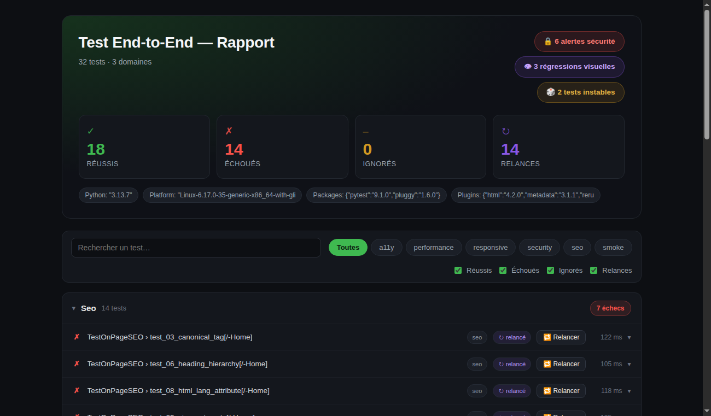
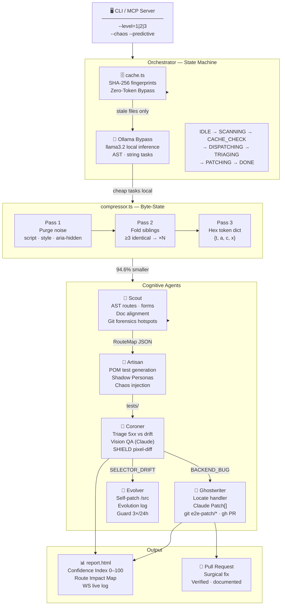

<p align="center">
  
</p>

<h1 align="center">test-end-to-end — V-Infinite</h1>

<p align="center"><i>The autonomous cognitive QA factory for Claude Code.</i></p>

<p align="center">
  <a href="https://github.com/Aronbfrt/test-end-to-end/releases"></a>
  <a href="https://www.typescriptlang.org/"></a>
  <a href="https://modelcontextprotocol.io"></a>
  
  
</p>

<p align="center">
  <a href="#-architecture"><b>Architecture</b></a> ·
  <a href="#-commands"><b>Commands</b></a> ·
  <a href="#-shadow-personas"><b>Shadow Personas</b></a> ·
  <a href="#-dashboard--real-time-analytics"><b>Dashboard</b></a> ·
  <a href="#-installation"><b>Install</b></a>
</p>

---

> **Zero human prompt required.** Drop it on any codebase — `test-end-to-end` reverse-engineers your routes, generates a full Playwright POM test suite, triages every crash with AI vision, heals broken selectors automatically, and opens surgical Pull Requests. All while routing 94.6% of processing through local Ollama inference, spending near-zero Anthropic tokens.

---

## ✦ Key metrics

> `0 TypeScript errors` · `94.6% token reduction` on real pages · `73 files bypassed` on cache hit · `20 hotspots ranked` from 12-month Git forensics · `< 800ms` cold scan on 73-file repo

---

## ⚡ Architecture



---

## 📁 Project layout

```
test-end-to-end/
│
├── src/                        TypeScript MCP engine (V-Infinite)
│   ├── index.ts                CLI + MCP stdio server (6 tools)
│   ├── orchestrator.ts         State machine · Ollama routing · agent dispatch
│   ├── agents/
│   │   ├── scout.ts            AST · doc alignment · Git forensics
│   │   ├── artisan.ts          POM generator · Shadow Personas · Chaos
│   │   ├── coroner.ts          Triage · Vision QA · SHIELD pixel-diff
│   │   ├── ghostwriter.ts      Bug patch · e2e-patch/* branch · PR
│   │   └── evolver.ts          Self-improvement · evolution-log.jsonl
│   ├── utils/
│   │   ├── cache.ts            SHA-256 fingerprints — atomic crash-safe writes
│   │   ├── compressor.ts       Byte-State DOM compressor (95% reduction)
│   │   └── logDigest.ts        Crash → triptyque (assertion + DOM + console)
│   └── server/
│       └── app.ts              Express + WebSocket dashboard + CI/CD report
│
├── commands/                   Claude Code slash commands (Python/legacy stack)
│   ├── e2e-audit.md
│   ├── e2e-init.md
│   ├── e2e-coverage.md
│   └── e2e-update.md
│
├── templates/
│   ├── e2e/                    Python · Selenium · Playwright · Cypress · Robot
│   ├── playwright/             playwright.config.ts blueprint
│   └── cypress/                cypress.config.ts blueprint
│
├── .e2e-cache.json             File fingerprint registry (git-ignored)
├── package.json                v2.0.0
└── tsconfig.json               ES2022 strict
```

---

## 🖥️  Commands

### Slash commands — Python / legacy stack

| Command | What it does |
|---|---|
| `/e2e-init` | Guided setup — framework choice, env vars, install |
| `/e2e-audit` | Full audit: basic + SEO + security + a11y + perf + responsive |
| `/e2e-coverage` | Route/form/API coverage map with % and gaps |
| `/e2e-update` | Smart sync after code changes — protects manual tests |

### CLI — TypeScript V-Infinite stack

```bash
npm install && npm run build

node dist/index.js <command> [flags]
```

| Command | Description |
|---|---|
| `init` | Stack detection · SHA-256 cache seed · POM scaffold |
| `audit` | Full audit + coroner triage + ghostwriter (level 2+) |
| `shadow` | Zero-Prompt Reverse Testing + all 3 Shadow Personas |
| `diff` | Scope to `git diff` · `--predictive` hotspot overlay |
| `repair` | Load coroner triage → ghostwriter patch → PR |

| Flag | Effect |
|---|---|
| `--level=1` | Local AST only — 0 LLM calls |
| `--level=2` | Hybrid: Vision QA on selector failure *(default)* |
| `--level=3` | Meta-Agent Infinite: Personas + Ghostwriter + Evolver |
| `--chaos` | Network faults · double-click race · i18n permutations |
| `--predictive` | 12-month Git forensics → Psychological Code Hotspots |
| `--reset-cache` | Wipe `.e2e-cache.json`, force full rescan |
| `--mcp` | Start as MCP stdio server |

### MCP tools — nested AI orchestration

```jsonc
// .mcp.json
{
  "mcpServers": {
    "e2e": {
      "command": "node",
      "args": ["dist/index.js", "--mcp"],
      "cwd": "/absolute/path/to/test-end-to-end"
    }
  }
}
```

Available tools: `e2e_init` · `e2e_audit` · `e2e_shadow` · `e2e_diff` · `e2e_repair` · `e2e_diagnostics`

---

## 🦙 Zero-Token Bypass

> When Ollama is detected on the host, all AST parsing, string classification and selector ranking route through **local inference** — zero Anthropic API cost.

When a file's SHA-256 fingerprint matches the cache, the agent is never invoked:

```
Run 1 (cold)  — 73 files → 73 stale  (0  bypassed)   full scan
Run 2 (warm)  — 73 files → 0  stale  (73 bypassed)   100% cache hit, 0 tokens
```

The Byte-State compressor reduces DOM payloads for Vision QA calls:

```
18 580 B raw HTML  →  1 002 B Byte-State  →  94.6% reduction
```

---

## 👤 Shadow Personas

Activated with `--chaos` or `--level=3`. Three cognitive extreme profiles stress every route.

| Persona | Injected behaviour |
|---|---|
| `frustrated_user` | Rage-click ×3 on every interactive element · form abandonment mid-fill · back-nav mid-flow |
| `impulsive_buyer` | Skips required fields · forces checkout submission · ignores validation |
| `malicious_attacker` | XSS × 6 payloads · SQLi × 5 · path traversal · prompt injection (if AI route detected) |
| `chaos_network` | Offline mid-form · 200ms/req throttle · double-submit idempotency check |

> **Security note:** `malicious_attacker` auto-detects AI-powered routes (`/chat`, `/ask`, `/gpt`, `/assistant` …) and runs prompt injection payloads against them.

---

## 🔬 SHIELD — Pixel-Diff Anti-False-Alert

Coroner compares failure screenshot vs baseline using a pure-JS PNG decoder (no native deps) and perceptual RGBA distance.

| Parameter | Value | Purpose |
|---|---|---|
| Tolerance | `32 / 255` per channel | Absorbs ClearType, font hinting, OS anti-aliasing |
| Threshold | `1%` of total pixels | Minimum real difference before alert fires |
| Below threshold | `SHIELD ABSORBED — cosmetic noise` | No alert raised |
| Above threshold | Vision QA activated | Claude claude-sonnet-4-6 multimodal identifies resilient selector |

**Triage decision tree:**

```
HTTP 5xx            →  BACKEND_BUG    →  Ghostwriter
HTTP 200 + selector →  ASSERTION_BUG  →  fix test logic
HTTP 200, no selector
  SHIELD ≤ 1%       →  SELECTOR_DRIFT →  Vision QA → new CSS → POM updated
  SHIELD > 5%       →  LAYOUT_CHANGE  →  escalate to human
```

---

## 📊 Confidence Index

Every `report.html` and PR comment embeds a 0–100 score:

```
CI  =  passRate     × 60
     + cacheBonus   × 10   (cached files / total)
     + tokenBonus   × 10   (tokens saved / total)
     + coverage     × 20   (passed / total)
     − secFails     × 5    (failed attacker-persona tests)
     → clamped 0–100
```

---

## 🔮 Dashboard & Real-Time Analytics

The Express + WebSocket server (`src/server/app.ts`) streams every agent log line, state transition, and screenshot to the browser in real time.

```bash
node --input-type=module <<'EOF'
import { startServer } from './dist/server/app.js';
startServer(process.cwd());
EOF
# → http://127.0.0.1:4321
```

<p align="center">
  
  <br>
  <i>Live dashboard — Route Impact Map (green/amber/red), Confidence Index badge, WebSocket log stream, one-click Auto-Patch button.</i>
</p>

<p align="center">
  
  <br>
  <i>Standalone <code>report.html</code> — fully self-contained, embeds CI score, route tree and crash replays. Zero external assets.</i>
</p>

**Dashboard endpoints:**

| Route | Description |
|---|---|
| `GET /` | report.html (or onboarding screen) |
| `GET /api/status` | Orchestrator state + Ollama capability JSON |
| `GET /api/report` | Full report HTML as JSON payload |
| `POST /api/repair` | Queue ghostwriter for a traceId |
| `WS /ws` | Bidirectional live event stream |

**WebSocket event types:** `LOG` · `STATE` · `SCREENSHOT` · `METRIC` · `HOTSPOT` · `REPORT_READY`

---

## 🧬 Git Forensics — Psychological Code Hotspots

> `--predictive` analyses the last 12 months of `git log`. Commits are scored for stress markers, cross-weighted with file churn, and the top 20 risky files receive denser test coverage.

| Commit pattern | Stress score |
|---|---|
| `fix`, `hotfix`, `urgent`, `critical`, `asap` | **+3** |
| `wip`, `temp`, `hack`, `dirty`, `quick` | **+2** |
| Expletives — `crap`, `wtf`, `ugh`, `damn` … | **+3** |
| `revert`, `rollback`, `oops`, `broke` | **+2** |
| Late-night commit (23h – 04h) | **+2** |
| `!!` excitement | **+1** |

```
riskScore = churn × 1.0 + stress × 1.5

Example output (this repo — 12-month window):
  1. commands/e2e-audit.md   risk=154.0  (churn=28, stress=84)
  2. commands/e2e-init.md    risk=81.0   (churn=15, stress=44)
  3. README.md               risk=74.0   (churn=14, stress=40)
```

---

## 🤖 Autonomous Repair Pipeline

```
Test failure detected
        │
        ▼
  Coroner triage
        │
        ├─── HTTP 5xx ──────────────────────────────────────────────────────┐
        │    BACKEND_BUG                                                     │
        │    Ghostwriter:                                                    │
        │      1. locateHandler()  — path slug + grep fallback              │
        │      2. Claude Sonnet    — generates Patch[] (exact oldCode)      │
        │      3. git checkout -b  e2e-patch/<timestamp>-<route>            │
        │      4. applyPatch()     — surgical string replacement            │
        │      5. npx playwright test --grep <route>  — verification        │
        │      6. gh pr create     — documented PR (fallback: .md draft)    │
        │                                                                    ▼
        │                                                             Pull Request
        │
        └─── HTTP 200 ──────────────────────────────────────────────────────┐
             │                                                               │
             ├── selector found    → ASSERTION_BUG  (fix test logic)        │
             │                                                               │
             └── selector missing                                            │
                 │                                                           │
                 ├── SHIELD ≤ 1%  → SELECTOR_DRIFT                          │
                 │   Vision QA: Claude claude-sonnet-4-6 multimodal          │
                 │   screenshot → resilient CSS → POM updated               │
                 │                                                           │
                 └── visual diff > 5%  → LAYOUT_CHANGE → escalate          ─┘
```

---

## 🦠 Self-Evolution (Evolver)

On agent failure at `--level=3`:

1. Reads failing agent TypeScript source from `/src`
2. Claude analyses root cause → `improvements[]` (exact `oldCode` match, max 3)
3. Applies surgical patch · commits `refactor(evolver): self-patch <agent>`
4. Optional revised system prompt stored to `.e2e-work/prompts/<agent>.system.txt`
5. Appends full record to `.e2e-work/evolution-log.jsonl`

> **Guard:** after 3 failures on the same agent type within 24h, Evolver stops and escalates to human. No infinite self-modification loops.

---

## 🚀 Installation

### Python / Selenium legacy stack

```bash
# Copy templates
cp -r templates/e2e/ tests/

# Core dependencies
pip install pytest selenium pytest-html requests

# Framework-specific (install only what you use)
pip install robotframework robotframework-seleniumlibrary robotframework-requests
pip install playwright && playwright install chromium
npm install --save-dev @playwright/test   # Playwright TS
npm install --save-dev cypress            # Cypress

# Configure
cp tests/.env.test.example tests/.env.test
# → Edit TEST_BASE_URL, TEST_USERNAME, TEST_PASSWORD, TEST_LOGIN_PATH
```

### TypeScript V-Infinite stack

```bash
git clone https://github.com/Aronbfrt/test-end-to-end.git
cd test-end-to-end
npm install && npm run build

# Run audit on your project
node dist/index.js audit --level=2 --predictive

# Start live dashboard
node --input-type=module <<'EOF'
import { startServer } from './dist/server/app.js';
startServer('/path/to/your/project');
EOF
```

---

## ⚙️ Environment variables

```env
# Target application
TEST_BASE_URL=http://localhost:3000
TEST_USERNAME=test@example.com
TEST_PASSWORD=testpassword

# Route configuration
TEST_LOGIN_PATH=/login              # /connexion, /signin, /auth/login …
TEST_ADMIN_DASHBOARD_PATH=/admin
TEST_AUTH_URL_HINTS=login,signin,auth

# Server
E2E_PORT=4321
OLLAMA_HOST=http://127.0.0.1:11434  # auto-detected if omitted
```

---

## 🧪 Supported frameworks

| Framework | `/e2e-init` | `/e2e-audit` | `/e2e-coverage` | `/e2e-update` | V-Infinite MCP |
|---|:---:|:---:|:---:|:---:|:---:|
| **Selenium + pytest** | ✅ | ✅ | ✅ | ✅ | — |
| **Playwright Python** | ✅ | ✅ | ✅ | ✅ | — |
| **Playwright TypeScript** | ✅ | ✅ | ✅ | ✅ | ✅ |
| **Cypress** | ✅ | ✅ | ✅ | ✅ | ✅ |
| **Robot Framework** | ✅ | ✅ | ✅ | ✅ | — |
| **MCP native (TS)** | ✅ | ✅ | — | — | ✅ |

---

<p align="center">
  <sub>Built with Claude Sonnet · Ollama Zero-Token Bypass · MCP Protocol · TypeScript 5.4</sub><br>
  <sub><b>Author:</b> <a href="https://github.com/Aronbfrt">Aron Beaufort</a> · MIT License</sub>
</p>
