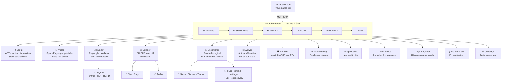

<div align="center">

# 🤖 test-end-to-end

### Le plugin Claude Code qui détecte, diagnostique et corrige vos bugs automatiquement.

**Du crash à la Pull Request — sans intervention humaine.**

[](https://claude.ai/code)
[](https://www.typescriptlang.org/)
[](https://playwright.dev/)
[](https://ollama.ai/)
[](LICENSE)
[](https://github.com/Aronbfrt/test-end-to-end)

</div>

---

## Ajouter à Claude Code en 30 secondes

```bash
# 1. Cloner et builder
git clone https://github.com/Aronbfrt/test-end-to-end
cd test-end-to-end && npm run setup

# 2. Enregistrer comme serveur MCP
claude mcp add test-end-to-end -- node /chemin/absolu/dist/index.js --mcp
```

Ensuite, dans Claude Code :

```
Audite mon projet et corrige les bugs automatiquement.

→ Claude appelle e2e_audit({ targetPath: "/mon/projet", level: 3 })
→ 13 agents se coordonnent
→ Ghostwriter ouvre une PR GitHub avec le correctif
```

---

## Ce que ça fait concrètement

Voici une session réelle avec Claude Code :

```
You: Teste mon app Express et répare ce qui est cassé.

Claude: Je lance l'audit niveau 3 sur /home/user/mon-app...

[e2e_audit] Scout détecte 8 routes, 3 formulaires — stack: Express 4.x
[e2e_audit] Artisan génère 24 specs Playwright (base + Shadow Personas)
[e2e_audit] Runner exécute les tests — 2 FAIL sur /api/checkout
[e2e_audit] Coroner: BACKEND_BUG (confiance 94%) — TypeError: Cannot read properties of undefined
[e2e_audit] Ghostwriter: patch appliqué sur src/routes/checkout.js:142
[e2e_audit] PR #47 ouverte → github.com/user/mon-app/pull/47

✓ Bug détecté, diagnostiqué, et corrigé. La PR attend votre review.
```

**Zéro configuration de tests. Zéro instruction à Claude.** Le plugin analyse votre code, comprend votre stack, et agit.

---

## 11 outils MCP disponibles dans Claude

| Outil | Ce que Claude peut faire |
|-------|--------------------------|
| `e2e_audit` | Audit complet : scan → tests → triage → auto-fix → PR |
| `e2e_shadow` | Tests adversariaux (Frustrated User, Impulsive Buyer, Malicious Attacker) |
| `e2e_diff` | Audit ciblé sur le `git diff` actuel uniquement |
| `e2e_repair` | Ghostwriter : correctif chirurgical + PR GitHub |
| `e2e_sentinel` | Audit sécurité OWASP des Pull Requests ouvertes |
| `e2e_arch` | Score architectural 0–100 (complexité cyclomatique, couplage, `any`) |
| `e2e_chaos` | Specs de résilience réseau (latence / timeout / offline / JSON corrompu) |
| `e2e_coverage` | Carte de couverture routes/API avec pourcentages et gaps |
| `e2e_update` | Sync intelligente des tests après refactoring |
| `e2e_init` | Initialisation du projet cible (détection stack, scaffold) |
| `e2e_diagnostics` | État de l'orchestrateur + config Ollama + snapshot cache |

---

## Architecture — 13 agents spécialisés



---

## Niveaux d'audit

```bash
# Niveau 1 — Tests générés et exécutés (1–2 min)
e2e_audit({ targetPath: "/mon/app", level: 1 })

# Niveau 2 — + Triage Coroner : verdict + confidence (3–5 min)
e2e_audit({ targetPath: "/mon/app", level: 2 })

# Niveau 3 — + Ghostwriter : patch automatique + PR GitHub (5–10 min)
e2e_audit({ targetPath: "/mon/app", level: 3 })
```

| Niveau | Agents actifs | Durée |
|--------|--------------|-------|
| 1 | Scout → Artisan → Runner | 1–2 min |
| 2 | + Coroner (triage IA) | 3–5 min |
| 3 | + Ghostwriter + QA Engineer | 5–10 min |

---

## Zero-Token Bypass

Chaque fichier est fingerprinté (SHA-256). Si le contenu n'a pas changé, **aucun agent n'est invoqué, aucun token dépensé.**

Lorsqu'[Ollama](https://ollama.ai) est détecté (`http://127.0.0.1:11434`), toutes les tâches d'inférence légères (AST, classification, healing de sélecteurs) sont routées localement. Seules les analyses profondes consomment des tokens Anthropic.

**Impact mesuré par run :**
- CO₂ évité : `tokens_saved × 0.00198 g`
- Budget FinOps : `tokens_saved × $0.000005`
- Toutes les métriques sont persistées dans SQLite (WAL mode)

---

## Shadow Personas

Quand vous tapez `e2e_shadow`, Artisan génère des tests depuis le point de vue de 3 utilisateurs adversariaux — **sans que vous décriviez une seule fonctionnalité** :

| Persona | Comportement simulé |
|---------|---------------------|
| `frustrated_user` | Clics répétés, double-soumissions, navigation arrière agressive |
| `impulsive_buyer` | Checkout accéléré, données de carte incomplètes, abandon au milieu |
| `malicious_attacker` | XSS (`<script>alert(1)</script>`), injections SQL, IDOR, path traversal |

---

## Verdicts Coroner

| Verdict | Cause | Action automatique |
|---------|-------|-------------------|
| `SELECTOR_DRIFT` | Sélecteur CSS/XPath cassé | Evolver tente la guérison |
| `ASSERTION_BUG` | Test vérifie une valeur devenue incorrecte | QA Engineer → test de régression |
| `LAYOUT_CHANGE` | Diff visuel > 1% (SHIELD pixel diff PNG) | Screenshot + rapport |
| `BACKEND_BUG` | Erreur 5xx / panic / OOM côté serveur | Ghostwriter corrige + PR |
| `HTTP5xx` | 5xx sans corrélation backend | Alerte ChatOps + ticket Jira |
| `UNKNOWN` | Cause indéterminée | Rapport manuel requis |

---

## Sentinel — Audit sécurité des PRs

```
You: Audite les PRs ouvertes pour des failles de sécurité.

→ Claude appelle e2e_sentinel({ targetPath: "/mon/app" })
→ Sentinel récupère le diff de chaque PR via gh CLI
→ Ollama (ou regex OWASP) analyse : injections, backdoors, secrets hardcodés...
→ GitHub review postée : APPROVE / COMMENT / REQUEST_CHANGES
→ Score de risque 0–100 notifié sur Slack
```

---

## Intégrations (opt-in)

Toutes les intégrations sont **désactivées par défaut**. Remplissez une variable → le module s'active.

```bash
# ChatOps
SLACK_WEBHOOK_URL=https://hooks.slack.com/services/...
DISCORD_WEBHOOK_URL=https://discord.com/api/webhooks/...
TEAMS_WEBHOOK_URL=https://outlook.office.com/webhook/...

# Gestion de projet
JIRA_URL=https://monprojet.atlassian.net
JIRA_TOKEN=ATATT3xxx
TRELLO_API_KEY=xxx
TRELLO_TOKEN=xxx

# Hébergeurs européens
OVH_APP_KEY=xxx                            # OVHcloud
IONOS_GITHUB_REPO=owner/repo              # IONOS via GitHub Actions
HOSTINGER_DEPLOY_WEBHOOK_URL=https://...  # Hostinger

# Récupération logs SSH (post-crash)
SSH_HOST=123.456.789.0
SSH_USER=ubuntu
SSH_PRIVATE_KEY=/home/user/.ssh/id_rsa

# GitHub (Ghostwriter + Sentinel)
GITHUB_TOKEN=ghp_xxx
```

---

## RGPD — Zéro PII sur disque

Le RGPD Guard intercepte **avant toute persistance** :

```
eyJhbGciOiJIUzI1NiJ9...   →   [MASKED_JWT]
sk-proj-abc123...           →   [MASKED_API_KEY]
user@exemple.com            →   [MASKED_EMAIL]
4242 4242 4242 4242         →   [MASKED_CARD]
FR76 3000 6000 0112...      →   [MASKED_IBAN]
```

---

## Dashboard temps réel

```bash
npm run dashboard /chemin/vers/projet
# → http://127.0.0.1:4321
```

WebSocket live : logs en streaming, state machine, screenshots Playwright, métriques SQLite.

```
GET /api/metrics     → FinOps, CO₂, RGPD masqués
GET /api/runs        → Historique des audits
GET /api/triages     → Historique Coroner
GET /api/arch        → Rapport ArchPolice
GET /api/dependabot  → Rapport sécurité deps
POST /api/repair     → Déclenche Ghostwriter
```

---

## Installation complète

### Option A — Automatique (recommandée)

```bash
git clone https://github.com/Aronbfrt/test-end-to-end
cd test-end-to-end
npm run setup
claude mcp add test-end-to-end -- node $(pwd)/dist/index.js --mcp
```

### Option B — Manuelle

```bash
npm install
npx tsc --build
npx playwright install chromium
cp .env.example .env   # puis remplir selon vos besoins
claude mcp add test-end-to-end -- node /chemin/absolu/dist/index.js --mcp
```

### Vérifier l'installation

```bash
claude mcp list   # doit afficher test-end-to-end
```

Puis dans Claude Code : *"Diagnostique l'état du plugin E2E"* → Claude appelle `e2e_diagnostics`.

---

## Usage CLI (sans Claude Code)

```bash
# Audit complet niveau 3
node dist/index.js audit /mon/projet --level=3

# Shadow Personas
node dist/index.js shadow /mon/projet

# Audit sécurité PRs
node dist/index.js sentinel /mon/projet [--pr=42]

# Analyse architecturale
node dist/index.js arch /mon/projet

# Chaos réseau
node dist/index.js chaos /mon/projet

# Sécurité dépendances
npm run security-fix

# Dashboard
npm run dashboard /mon/projet
```

---

## Stacks supportées

Scout détecte automatiquement le framework et adapte les tests :

`Express · Fastify · NestJS · Next.js · Nuxt · SvelteKit · Laravel · Django · Rails · FastAPI · Go Fiber`

---

## Structure

```
src/
├── agents/          # 13 agents spécialisés
├── integrations/    # Slack · Jira · Trello · OVH · SSH
├── server/          # Dashboard Express + WebSocket
├── utils/           # Cache · SQLite · StripeMock · Report
└── orchestrator.ts  # Machine à états centrale
```

---

## Contribuer

```bash
git clone https://github.com/Aronbfrt/test-end-to-end
npm run setup
npx tsc --noEmit   # → 0 erreur
```

Issues, PRs et étoiles ⭐ bienvenues.

---

<div align="center">

**MIT License** — [Aron Beaufort](https://github.com/Aronbfrt)

*Construit avec TypeScript strict · Playwright · Ollama · Zero placeholders · Zero ellipses.*

</div>
