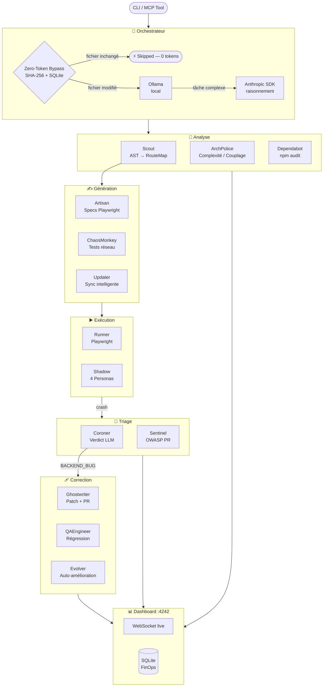
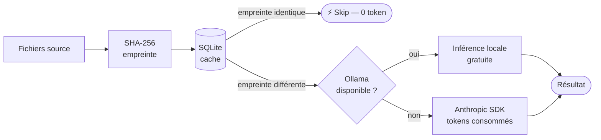
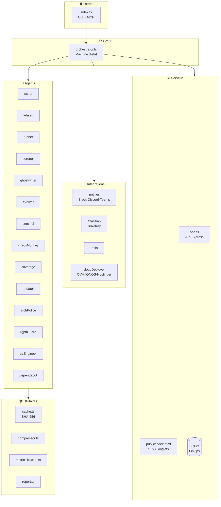

<p align="center">
  
</p>

<p align="center">
  
  
  
  
  
  
</p>

<h3 align="center">La fabrique QA cognitive autonome pour Claude Code — 13 agents spécialisés.</h3>

<p align="center">
  Analyse l'AST de votre projet, génère des tests Playwright, les exécute, triage les crashs, corrige les bugs<br>
  et ouvre la PR — sans écrire une seule ligne de configuration ni de test.<br>
  Compatible Node.js, TypeScript, PHP et Python. Zéro setup requis.
</p>

<p align="center">
  <a href="#prérequis">Prérequis</a> ·
  <a href="#installation">Installation</a> ·
  <a href="#démarrage-rapide">Démarrage rapide</a> ·
  <a href="#commandes">Commandes</a> ·
  <a href="#architecture">Architecture</a> ·
  <a href="#dashboard">Dashboard</a> ·
  <a href="#intégrations">Intégrations</a>
</p>

---

## Comment ça marche

```
Votre projet
     │
     ▼
┌─────────────────────────────────────────────────────────────────┐
│                         ORCHESTRATEUR                           │
│            Zero-Token Bypass (empreinte SHA-256)                │
│              Ollama  ←──────────────────→  Anthropic            │
│         (AST / string / tâches légères)  (raisonnement)         │
└────┬──────────┬──────────┬──────────┬──────────┬───────────────┘
     │          │          │          │          │          │
     ▼          ▼          ▼          ▼          ▼          ▼
  Scout      Artisan    Runner     Coroner   Ghostwriter  Sentinel
  Scan AST   Génération Playwright  Triage    Patch + PR   Audit
  routes     specs      exécution   crashs    dry-run      OWASP
  forms                             verdicts
     │          │          │          │          │          │
     ▼          ▼          ▼          ▼          ▼          ▼
 Coverage  ChaosMonkey  Updater  ArchPolice  Evolver   Dependabot
 carte %   LATENCY      sync     complexité  gate       npm audit
           OFFLINE      smart    couplage    supervisé  auto-fix
           CORRUPT
     │          │          │          │          │          │
     └──────────┴──────────┴──────────┴──────────┴──────────┘
                                  │
                                  ▼
                       Dashboard  localhost:4242
                  (8 onglets · WebSocket live · Confidence Index)
```

---

## Prérequis

| Outil | Version min | Utilité |
|---|---|---|
| Node.js | ≥ 18.0.0 | Runtime — ESM + fetch natif requis |
| npm | ≥ 9.0.0 | Gestionnaire de paquets |
| Claude Code | latest | Hôte du plugin |
| Playwright | auto-installé | Exécuteur de tests navigateur |
| GitHub CLI `gh` | quelconque | Audit PR Sentinel + création PR Ghostwriter |
| Ollama | optionnel | Zero-Token Bypass pour l'inférence locale |

---

## Installation

```bash
git clone https://github.com/Aronbfrt/test-end-to-end
cd test-end-to-end
npm install
npm run build
```

Ajouter dans `.claude/settings.json` :

```json
{
  "plugins": ["./chemin/vers/test-end-to-end"]
}
```

---

## Démarrage rapide

```bash
# 1. Analyser le projet et générer les tests
node dist/index.js init /votre/projet
# → Détecte le stack, extrait routes + forms, écrit tests/*.spec.ts

# 2. Lancer l'audit complet
node dist/index.js audit /votre/projet
# → Joue Playwright, triage les crashs, ouvre une PR de patch si bug confirmé

# 3. Ouvrir le dashboard live
npm run dashboard
# → http://localhost:4242
```

---

## Commandes

| Commande | Ce qu'elle fait | Sortie principale |
|---|---|---|
| `e2e-init` | Scan AST, détecte routes/forms, génère les specs Playwright | `tests/*.spec.ts`, `.e2e-work/last-routes.json` |
| `e2e-audit` | Pipeline complet : scan → run → triage → patch | Score Confidence Index, rapports de crash |
| `e2e-coverage` | Carte de couverture routes/forms avec % | Tableau dans le terminal |
| `e2e-update` | Sync intelligente des tests après modifications, protège les tests manuels | Specs mises à jour, résumé du diff |
| `e2e-repair` | Triage un crash + patch dry-run via Ghostwriter | `.e2e-work/patches-pending/` |
| `e2e-sentinel` | Audit OWASP des PRs ouvertes via GitHub CLI | `APPROVE` / `REJECT` / `COMMENT` avec findings |
| `e2e-chaos` | Génère des tests réseau chaotiques (LATENCY, OFFLINE, CORRUPT…) | Fichiers `chaos_*.spec.ts` |
| `e2e-arch` | Analyse statique : complexité, couplage, `any`, longueur de fichiers | `arch-report.md` |
| `e2e-diff` | Comparaison avant/après routes suite à des modifications | Tableau de diff dans le terminal |
| `e2e-shadow` | Reverse Testing zéro-prompt — 4 shadow personas (Frustré, Attaquant, Chaos Réseau, Acheteur Impulsif) génèrent des tests E2E inférés sans aucune description de feature | `tests/shadow/<persona>-<route>.spec.ts` |

### Options

```bash
--level=1|2|3       # Profondeur : 1=basique, 2=+Vision QA, 3=+auto-patch
--dry-run           # Affiche les changements prévus sans écrire les fichiers
--apply             # Ghostwriter : applique les patches sur disque et ouvre la PR
--unsupervised      # Evolver : auto-commit des auto-patches (dangereux)
--chaos             # Injecte des fautes réseau en parallèle du run
--predictive        # Priorise les fichiers à fort taux de churn (historique git)
--trace=<id>        # Répare un triage spécifique par son ID
```

---

## Architecture

### Pipeline d'exécution



### Les 13 agents

| Agent | Rôle |
|---|---|
| **Scout** | Parsing AST avec `ts-morph` — extrait routes, forms, handlers, détecte le stack (Express, Next.js, PHP, Django…) |
| **Artisan** | Génère des specs Playwright depuis la `RouteMap` — couvre happy path, edge cases, flux auth |
| **Runner** | Exécute Playwright, parse la sortie JSON reporter, écrit `CrashContext` pour chaque échec |
| **Coroner** | Triage les crashs → verdict : `BACKEND_BUG`, `SELECTOR_DRIFT`, `NETWORK_ERROR`, `UNKNOWN` |
| **ChaosMonkey** | Injecte du chaos réseau via `page.route()` : `LATENCY`, `TIMEOUT`, `ERROR_50x`, `OFFLINE`, `CORRUPT`, `PARTIAL` |
| **RGPDGuard** | Masque les PII avant écriture sur disque — JWT, clés API, emails, IBAN, numéros de carte |
| **Sentinel** | Audit OWASP des PRs via `gh` CLI — détecte injections, backdoors, logique d'auth cassée |
| **Coverage** | Carte de couverture routes/forms avec %, met en évidence les endpoints non testés |
| **Updater** | Sync intelligente des tests après changements de routes — protège les tests manuels de l'écrasement |
| **QAEngineer** | Génère des tests de régression après les patches Ghostwriter pour verrouiller le fix |
| **ArchPolice** | Détecte complexité élevée, couplage excessif, `any` dangereux, fichiers surdimensionnés |
| **Ghostwriter** | Corrige les bugs applicatifs + ouvre une PR — dry-run par défaut, `--apply` pour déployer sur disque |
| **Evolver** | Auto-améliore les prompts des agents depuis l'analyse des échecs — supervisé par défaut, propositions dans `.e2e-work/evolutions-pending/` |
| **Dependabot** | `npm audit` → fix analysé par LLM → vérification `tsc --noEmit` → PR |

### Zero-Token Bypass



- **SHA-256** calcule l'empreinte de chaque fichier source au premier scan
- **SQLite** (mode WAL) stocke l'état du dernier scan par projet
- Les fichiers non modifiés sont **ignorés entièrement** — zéro token consommé
- **Ollama** prend en charge les tâches légères d'AST et de classification localement
- **Anthropic SDK** réservé au raisonnement sémantique (triage, génération de patches, audit OWASP)
- Résultat : **jusqu'à 90% de réduction de tokens** sur les runs incrémentaux

---

## Dashboard

<p align="center">
  
</p>

<p align="center">
  
  
</p>

<p align="center">
  
  
</p>

```bash
npm run dashboard
# → http://localhost:4242
```

### 8 Onglets

| Onglet | Contenu |
|---|---|
| **Runs** | Historique complet des runs avec Confidence Index (0–100), durée, compteurs pass/fail |
| **Coverage** | Carte de couverture routes et forms — vert/rouge par endpoint, % global |
| **Crashs** | Tous les résultats de triage avec verdict, raisonnement et déclencheur de réparation en un clic |
| **Évolutions** | Propositions Evolver en attente — revue et application via `e2e-evolve-apply <fichier>` |
| **Sentinel** | Findings OWASP par PR — sévérité, route, recommandation |
| **ArchPolice** | Violations architecture : scores de complexité, matrice de couplage, heatmap taille de fichiers |
| **Intégrations** | Statut live des services connectés (Slack, Jira, OVH…) |
| **FinOps** | Consommation de tokens, CO₂ économisé vs. run complet, delta de coût, compteur masques RGPD |

> Mode sombre · Mises à jour live WebSocket · Confidence Index (0–100) · Zéro CDN externe

---

## Intégrations

Toutes les intégrations sont **optionnelles**. Le plugin fonctionne entièrement sans aucune d'elles.

| Intégration | Variables d'environnement | Déclencheur |
|---|---|---|
| Slack | `SLACK_WEBHOOK_URL` | Crash détecté, patch appliqué, résultat sentinel |
| Discord | `DISCORD_WEBHOOK_URL` | Idem |
| Microsoft Teams | `TEAMS_WEBHOOK_URL` | Idem |
| Jira + Xray | `JIRA_URL`, `JIRA_TOKEN`, `JIRA_USER_EMAIL`, `JIRA_PROJECT_KEY` | Crash → ouvre un ticket bug / Patch → ferme le ticket |
| Trello | `TRELLO_KEY`, `TRELLO_TOKEN`, `TRELLO_LIST_ID` | Crash → crée une carte |
| OVHcloud | `OVH_APP_KEY`, `OVH_APP_SECRET`, `OVH_CONSUMER_KEY`, `OVH_PROJECT_ID` | Déclencheur de déploiement + récupération de logs SSH |
| IONOS | `IONOS_GITHUB_REPO`, `IONOS_GITHUB_TOKEN`, `IONOS_WORKFLOW_FILE` | CI/CD via `workflow_dispatch` |
| Hostinger | `HOSTINGER_DEPLOY_WEBHOOK_URL` | Déploiement par webhook HTTP générique |
| GitHub | `GITHUB_TOKEN` | Audit PR Sentinel, PR Ghostwriter, PR Dependabot |

Copier `.env.example` vers `.env` et renseigner uniquement ce qui est utilisé.

---

## Sécurité

- **Ghostwriter est en dry-run par défaut** — les patches ne sont jamais auto-appliqués sur disque sans `--apply`
- **Evolver est supervisé par défaut** — les auto-patches nécessitent une approbation humaine via `e2e-evolve-apply <fichier>` avant de toucher `src/`
- **Whitelist de commandes SSH** — seuls les patterns `tail`, `cat`, `journalctl`, `pm2` sont autorisés en SSH ; tout le reste est rejeté au niveau de l'intégration
- **RGPDGuard masque toutes les PII** avant écriture dans `.e2e-work/` — tokens JWT, clés API, emails, IBAN, numéros de carte
- **Aucune donnée sensible loggée sur stdout** — clés API et credentials SSH n'apparaissent jamais dans la console
- **Rate limiter sur tous les appels Anthropic SDK** — 5 requêtes simultanées max, rechargement token-bucket à 1/sec

---

## Structure du projet



<details>
<summary>📁 Arborescence complète</summary>

```
test-end-to-end/
├── src/
│   ├── orchestrator.ts            # Cerveau central : machine d'état, routage, Zero-Token Bypass
│   ├── index.ts                   # Point d'entrée CLI, parseur de commandes, e2e-evolve-apply
│   ├── agents/
│   │   ├── scout.ts               # Extraction AST routes/forms (ts-morph)
│   │   ├── artisan.ts             # Génération specs Playwright depuis RouteMap
│   │   ├── runner.ts              # Exécution des tests + capture du contexte de crash
│   │   ├── coroner.ts             # Triage : BACKEND_BUG / SELECTOR_DRIFT / NETWORK_ERROR
│   │   ├── ghostwriter.ts         # Génération de patches + création PR (dry-run par défaut)
│   │   ├── evolver.ts             # Auto-amélioration des agents — gate supervisé
│   │   ├── sentinel.ts            # Audit OWASP des PRs via gh CLI
│   │   ├── chaosMonkey.ts         # Injection de chaos réseau (6 scénarios)
│   │   ├── coverage.ts            # Carte de couverture routes/forms
│   │   ├── updater.ts             # Sync intelligente des tests après modifications
│   │   ├── archPolice.ts          # Analyse statique de l'architecture
│   │   ├── rgpdGuard.ts           # Masquage PII avant écriture disque
│   │   ├── qaEngineer.ts          # Génération de tests de régression post-patch
│   │   └── dependabot.ts          # npm audit + fix LLM + vérification + PR
│   ├── integrations/
│   │   ├── notifier.ts            # Webhooks Slack / Discord / Teams
│   │   ├── atlassian.ts           # Intégration Jira + Xray
│   │   ├── trello.ts              # Création de cartes Trello
│   │   └── cloudDeployer.ts       # Déploiement SSH OVH / IONOS / Hostinger
│   ├── server/
│   │   ├── app.ts                 # API Express dashboard (8 routes)
│   │   ├── start.ts               # Point d'entrée serveur, setup WebSocket
│   │   └── public/
│   │       └── index.html         # SPA dashboard 8 onglets — zéro CDN
│   └── utils/
│       ├── cache.ts               # Cache empreinte SHA-256 (SQLite)
│       ├── compressor.ts          # Compression de prompts Byte-State
│       ├── logDigest.ts           # Parsing et digest de logs
│       ├── metricsTracker.ts      # Métriques FinOps / Green-IT
│       └── report.ts              # Générateur de rapports CLI
├── commands/                      # Définitions des skills Claude Code (10 commandes)
├── docs/
│   └── assets/                    # Captures d'écran + logo
├── scripts/
│   └── setup.sh
├── .env.example
├── package.json
├── tsconfig.json
└── playwright.config.ts
```

</details>

---

## Contribuer

Les PRs sont les bienvenues — ouvrir une issue en premier pour les changements non triviaux.  
Lancer `npx tsc --noEmit` avant de soumettre — zéro erreur de type requise.  
Chaque nouvel agent doit respecter le contrat JSON typé défini dans `src/orchestrator.ts` (`AgentTask`, `RouteMap`, `BugReport`).

---

## Licence

MIT — Aron Beaufort
