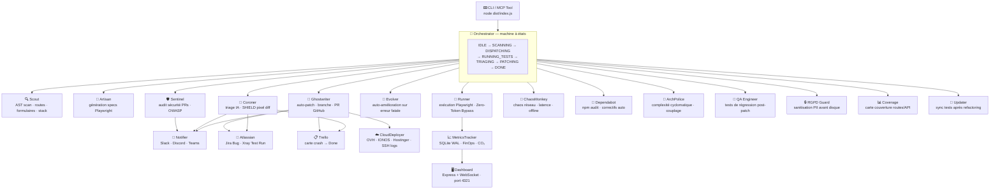

# test-end-to-end

[](https://www.typescriptlang.org/)
[](https://playwright.dev/)
[](https://ollama.ai/)
[](https://sqlite.org/)
[](LICENSE)
[](https://github.com/Aronbfrt/test-end-to-end)
[](https://github.com/Aronbfrt/test-end-to-end)

> **Agent E2E autonome** — Détecte, diagnostique et corrige automatiquement les régressions de votre application web. Du crash au correctif en production, sans intervention humaine.

---

## Vue d'ensemble

`test-end-to-end` est un écosystème de **13 agents spécialisés** qui collaborent autour d'un orchestrateur à état pour :

1. **Scanner** votre code source (AST, routes, formulaires, stack auto-détecté)
2. **Générer** des tests Playwright sur mesure (niveaux 1–3 + Shadow Personas)
3. **Exécuter** les tests avec Zero-Token Bypass (cache par fingerprint SHA-256)
4. **Diagnostiquer** chaque crash (SHIELD perceptuel, Ollama local, Anthropic)
5. **Corriger** automatiquement le code et ouvrir une PR GitHub (Ghostwriter)
6. **Notifier** votre équipe (Slack, Discord, Microsoft Teams)
7. **Tracer** chaque bug dans votre outil de gestion (Jira, Trello)
8. **Déployer** le correctif chez votre hébergeur (OVH, IONOS, Hostinger)
9. **Mesurer** l'impact en CO₂ et en budget FinOps (SQLite persisté)

---

## Architecture



---

## Agents

### Cœur du pipeline

| Agent | Rôle | Déclenché par |
|-------|------|---------------|
| **Scout** | Analyse AST multi-stack (TS/PHP/Python/Go/Rails), détecte routes + formulaires, identifie hotspots git | Phase 1 |
| **Artisan** | Génère des specs Playwright adaptées à la stack, avec assertions sémantiques et Shadow Personas | Phase 3 |
| **Runner** | Lance Playwright en mode CI, capture crashs + screenshots, applique le Zero-Token Bypass | Phase 3b |
| **Coroner** | Triage IA avec SHIELD (diff pixel PNG < 1% tolérance), classifie en SELECTOR_DRIFT / ASSERTION_BUG / LAYOUT_CHANGE / BACKEND_BUG / HTTP5xx / UNKNOWN | Phase 4 |
| **Ghostwriter** | Corrige le code, crée une branche git, ouvre une PR avec description structurée | Phase 5 |
| **Evolver** | S'auto-améliore sur erreur fatale (niveau 3 uniquement, guard anti-boucle) | Erreur fatale |
| **QA Engineer** | Génère un test de régression ciblé par type de verdict après chaque patch | Post-Ghostwriter |

### Agents spécialisés

| Agent | Commande | Rôle |
|-------|----------|------|
| **Sentinel** | `sentinel` | Audit sécurité des PRs : OWASP Top 10, backdoors, secrets hardcodés, typosquatting |
| **ChaosMonkey** | `chaos` | Génère des specs de chaos réseau (latence/timeout/5xx/offline/JSON corrompu) |
| **Dependabot** | `npm run security-fix` | `npm audit` → correctifs auto → PR sécurité GitHub |
| **ArchPolice** | `arch` | Analyse ts-morph : complexité cyclomatique > 10, fonctions > 80 lignes, `any` implicite |
| **RGPD Guard** | Automatique | Masque JWT / API keys / email / CB / IBAN / IP avant toute écriture disque |
| **Coverage** | `coverage` | Cartographie les routes et API avec leur niveau de couverture |
| **Updater** | `update` | Sync intelligente des specs après refactoring (protège les tests manuels) |

### Intégrations

| Module | Variables .env requises | Comportement si absent |
|--------|------------------------|------------------------|
| **Notifier** (Slack/Discord/Teams) | `SLACK_WEBHOOK_URL` ou `DISCORD_WEBHOOK_URL` ou `TEAMS_WEBHOOK_URL` | Silencieux — pas de notification |
| **Atlassian** (Jira + Xray) | `JIRA_URL` + `JIRA_TOKEN` | Pas de ticket créé |
| **Trello** | `TRELLO_API_KEY` + `TRELLO_TOKEN` + `TRELLO_TODO_LIST_ID` + `TRELLO_DONE_LIST_ID` | Pas de carte créée |
| **CloudDeployer** (OVH) | `OVH_APP_KEY` + `OVH_APP_SECRET` + `OVH_CONSUMER_KEY` | Provider ignoré |
| **CloudDeployer** (IONOS) | `IONOS_GITHUB_REPO` + `IONOS_GITHUB_TOKEN` | Provider ignoré |
| **CloudDeployer** (Hostinger) | `HOSTINGER_DEPLOY_WEBHOOK_URL` | Provider ignoré |
| **SSH Log Recovery** | `SSH_HOST` + `SSH_USER` + `SSH_PRIVATE_KEY` | Logs distants non récupérés |
| **StripeMock** | `STRIPE_WEBHOOK_SECRET` (optionnel) | Clé de test utilisée |
| **Sentinel** | `GITHUB_TOKEN` + GitHub CLI installé | Agent désactivé |

---

## Installation

### Prérequis

- **Node.js ≥ 18**
- **Ollama** (optionnel mais recommandé — Zero-Token Bypass)
- **GitHub CLI `gh`** (optionnel — Ghostwriter + Sentinel)

### Setup automatique (recommandé)

```bash
git clone https://github.com/Aronbfrt/test-end-to-end
cd test-end-to-end
npm run setup
```

Le script `scripts/setup.sh` :
- Vérifie Node ≥ 18
- `npm install`
- `npx tsc --build`
- Installe Playwright Chromium
- Détecte Ollama → pull `llama3.2` si absent
- Génère `.env` depuis le template
- Crée `.e2e-work/` + met à jour `.gitignore`

### Setup manuel

```bash
npm install
npx tsc --build
npx playwright install chromium
cp .env.example .env
# Remplir les variables souhaitées dans .env
```

---

## Configuration `.env`

Toutes les intégrations sont **opt-in** — une variable absente désactive le module correspondant sans erreur.

```bash
# ── LLM local (Zero-Token Bypass) ─────────────────────────────────────────────
OLLAMA_HOST=http://127.0.0.1:11434

# ── Dashboard ─────────────────────────────────────────────────────────────────
E2E_PORT=4321

# ── GitHub (Ghostwriter + Sentinel) ───────────────────────────────────────────
GITHUB_TOKEN=ghp_xxxxxxxxxxxxxxxxxxxxx

# ── ChatOps ───────────────────────────────────────────────────────────────────
SLACK_WEBHOOK_URL=https://hooks.slack.com/services/T.../B.../xxx
DISCORD_WEBHOOK_URL=https://discord.com/api/webhooks/.../xxx
TEAMS_WEBHOOK_URL=https://outlook.office.com/webhook/.../xxx

# ── Atlassian (Jira + Xray) ───────────────────────────────────────────────────
JIRA_URL=https://monprojet.atlassian.net
JIRA_TOKEN=ATATT3xxxxxxxxxxxxxxxxxxx
JIRA_USER_EMAIL=dev@monprojet.com
JIRA_PROJECT_KEY=QA

# ── Trello ────────────────────────────────────────────────────────────────────
TRELLO_API_KEY=xxxxxxxxxxxxxxxxxxxxxxxxxxxxxxxx
TRELLO_TOKEN=xxxxxxxxxxxxxxxxxxxxxxxxxxxxxxxxxxxxxxxxxxxxxxxxxxxxxxxxxxxxxxxx
TRELLO_TODO_LIST_ID=xxxxxxxxxxxxxxxxxxxx
TRELLO_DONE_LIST_ID=xxxxxxxxxxxxxxxxxxxx

# ── Stripe (test env uniquement — aucun appel Stripe réel) ────────────────────
STRIPE_WEBHOOK_SECRET=whsec_xxxxxxxxxxxxxxxxxxxxxxxx

# ── OVHcloud ──────────────────────────────────────────────────────────────────
OVH_APP_KEY=xxxxxxxxxxxx
OVH_APP_SECRET=xxxxxxxxxxxxxxxxxxxxxxxxxxxx
OVH_CONSUMER_KEY=xxxxxxxxxxxxxxxxxxxxxxxxxxxx
OVH_PROJECT_ID=xxxxxxxxxxxxxxxxxxxxxxxxxxxxxxxx
OVH_SERVICE_NAME=xxxxxxxx-xxxx-xxxx-xxxx-xxxxxxxxxxxx

# ── IONOS (via GitHub Actions) ────────────────────────────────────────────────
IONOS_GITHUB_REPO=owner/repo
IONOS_GITHUB_TOKEN=ghp_xxxxxxxxxxxxxxxxxxxxx
IONOS_WORKFLOW_FILE=deploy.yml
IONOS_DEPLOY_BRANCH=main

# ── Hostinger ────────────────────────────────────────────────────────────────
HOSTINGER_DEPLOY_WEBHOOK_URL=https://api.hostinger.com/webhook/deploy/xxx

# ── SSH log recovery ──────────────────────────────────────────────────────────
SSH_HOST=123.456.789.0
SSH_PORT=22
SSH_USER=ubuntu
SSH_PRIVATE_KEY=/home/user/.ssh/id_rsa

# ── Sécurité dépendances ──────────────────────────────────────────────────────
DEPENDABOT_MIN_SEVERITY=high
```

---

## Commandes

### Pipeline principal

```bash
# Niveau 1 : scan + génération + exécution des tests
node dist/index.js audit /chemin/vers/projet

# Niveau 2 : + triage Coroner (verdict + confidence)
node dist/index.js audit /chemin/vers/projet --level=2

# Niveau 3 : + auto-patch Ghostwriter + PR GitHub
node dist/index.js audit /chemin/vers/projet --level=3

# Shadow Personas (utilisateurs adversariaux)
node dist/index.js shadow /chemin/vers/projet

# Diff (tests limités aux fichiers modifiés)
node dist/index.js diff /chemin/vers/projet [--predictive]

# Réparation manuelle (traceId depuis .e2e-work/)
node dist/index.js repair /chemin/vers/projet [--trace=<traceId>]
```

### Agents spécialisés

```bash
# Couverture
node dist/index.js coverage /chemin/vers/projet [--detail]

# Synchronisation des tests après refactoring
node dist/index.js update /chemin/vers/projet [--dry-run]

# Audit sécurité des PRs ouvertes
node dist/index.js sentinel /chemin/vers/projet
node dist/index.js sentinel /chemin/vers/projet --pr=42

# Analyse architecturale (complexité, couplage, any implicite)
node dist/index.js arch /chemin/vers/projet

# Génération de specs de chaos réseau
node dist/index.js chaos /chemin/vers/projet

# Correctifs de sécurité npm
npm run security-fix

# Dashboard temps réel
npm run dashboard /chemin/vers/projet
```

---

## Niveaux d'audit

| Niveau | Agents actifs | Durée estimée |
|--------|--------------|---------------|
| `--level=1` | Scout → Artisan → Runner | 1–3 min |
| `--level=2` | + Coroner (triage IA) | 3–5 min |
| `--level=3` | + Ghostwriter (auto-patch + PR) | 5–10 min |

---

## Shadow Personas

Artisan génère des tests depuis le point de vue de 3 utilisateurs adversariaux :

| Persona | Comportement simulé |
|---------|---------------------|
| `frustrated_user` | Clics répétés, double-soumission de formulaires, navigation arrière agressive |
| `impulsive_buyer` | Parcours checkout accéléré, données partielles, abandon milieu de paiement |
| `malicious_attacker` | Payloads XSS (`<script>alert(1)</script>`), injections SQL, IDOR, traversée de chemin |

---

## Verdicts Coroner

| Verdict | Cause | Action automatique |
|---------|-------|-------------------|
| `SELECTOR_DRIFT` | Sélecteur CSS/XPath cassé après refactoring | Evolver tente la guérison |
| `ASSERTION_BUG` | Le test vérifie une valeur devenue incorrecte | QA Engineer génère un test de régression |
| `LAYOUT_CHANGE` | Différence visuelle > 1% (SHIELD perceptuel PNG diff) | Screenshot + rapport |
| `BACKEND_BUG` | Erreur 5xx serveur, panic, OOM | Ghostwriter corrige + PR |
| `HTTP5xx` | Réponse 5xx sans corrélation backend | Alerte ChatOps + ticket Jira |
| `UNKNOWN` | Cause indéterminée | Rapport manuel requis |

---

## Zero-Token Bypass

Chaque fichier est fingerprinté (SHA-256). Si le contenu n'a pas changé depuis le dernier run, aucun agent n'est invoqué et aucun token LLM n'est consommé.

Lorsqu'Ollama est détecté (`http://127.0.0.1:11434`), les tâches d'inférence légères (AST, classification, healing) sont routées localement. Seules les analyses sémantiques profondes consomment des tokens Anthropic.

**Métriques persistées dans SQLite** :
- Tokens économisés (cumul par run)
- CO₂ évité : `tokens_saved × 0.00198 g`
- Budget FinOps : `tokens_saved × $0.000005`

---

## RGPD — Sanitisation PII

Chaque crash context, log et rapport est filtré avant toute persistance disque :

| Type | Pattern | Masque |
|------|---------|--------|
| JWT | `eyJ...eyJ...sig` | `[MASKED_JWT]` |
| API Key | `sk-`, `ghp_`, `AKIA`, `whsec_`, `xoxb-` | `[MASKED_API_KEY]` |
| Champ secret JSON | `"password":"..."` | `"password":"[MASKED_SECRET]"` |
| Email | `user@domain.tld` | `[MASKED_EMAIL]` |
| Téléphone | Format FR/EU/US | `[MASKED_PHONE]` |
| Carte bancaire | 16 chiffres groupés | `[MASKED_CARD]` |
| IBAN | Format EU | `[MASKED_IBAN]` |
| IP publique | Exclut 10.x / 192.168.x / 172.16-31.x / 127.x | `[MASKED_IP]` |

Si Ollama disponible, un second passage détecte les fuites contextuelles (noms propres, adresses, numéros de dossier) non couverts par les regex.

---

## Dashboard

```bash
npm run dashboard /chemin/vers/projet
# → http://127.0.0.1:4321
```

**REST API** :

| Endpoint | Description |
|----------|-------------|
| `GET /api/status` | État de l'orchestrateur + config Ollama |
| `GET /api/report` | Dernier rapport HTML généré |
| `GET /api/log` | Log brut du dernier run |
| `GET /api/metrics` | Stats SQLite (FinOps, CO₂, RGPD, totaux) |
| `GET /api/runs` | Historique des audits |
| `GET /api/triages` | Historique des triages Coroner |
| `GET /api/arch` | Dernier rapport ArchPolice |
| `GET /api/dependabot` | Dernier rapport Dependabot |
| `POST /api/repair` | Déclenche Ghostwriter sur un traceId |

**WebSocket** `ws://127.0.0.1:4321/ws` — événements temps réel : `LOG` / `STATE` / `SCREENSHOT` / `METRIC` / `HOTSPOT` / `REPORT_READY`.

---

## Sentinel — Audit PRs

```bash
node dist/index.js sentinel /chemin/vers/projet        # toutes les PRs ouvertes
node dist/index.js sentinel /chemin/vers/projet --pr=42
```

Analyse le diff de chaque PR avec Ollama (si disponible) ou regex statiques :

- **Injections** : SQL, NoSQL, Command, LDAP, XPath
- **Backdoors** : exfiltration de données, reverse shells
- **Secrets hardcodés** : `sk-`, `ghp_`, `AKIA`, passwords en clair
- **Failles logiques** : bypass auth, IDOR, élévation de privilèges
- **SSRF / XXE / désérialization**
- **Typosquatting** de packages npm

Score de risque 0–100 → `APPROVE` (< 30) / `COMMENT` (30–60) / `REJECT` (≥ 60 ou CRITICAL).

Le verdict est posté comme review GitHub + notification ChatOps.

---

## ArchPolice — Analyse architecturale

```bash
node dist/index.js arch /chemin/vers/projet
# → .e2e-work/arch-report.json
# → .e2e-work/arch-report.md
```

Détecte les violations architecturales dans les fichiers TypeScript :

| Violation | Seuil |
|-----------|-------|
| `FUNCTION_TOO_LONG` | > 80 lignes |
| `HIGH_COMPLEXITY` | Complexité cyclomatique > 10 |
| `FILE_TOO_LARGE` | > 500 lignes |
| `EXCESSIVE_COUPLING` | > 15 imports par fichier |
| `UNSAFE_ANY` | Usage de `any` sans justification |
| `MISSING_RETURN_TYPE` | Fonction exportée sans type de retour |

Score de 0 à 100, grade A/B/C/D/F. Plan de refactoring généré par Ollama si disponible.

---

## Chaos Monkey — Tests de résilience

```bash
node dist/index.js chaos /chemin/vers/projet
```

Génère des specs Playwright pour chaque route testant 6 scénarios de défaillance réseau :

| Scénario | Perturbation |
|----------|-------------|
| `LATENCY` | +2–5 secondes sur les requêtes API et JSON |
| `TIMEOUT` | Abandon (`timedout`) de toutes les requêtes API |
| `ERROR_50x` | HTTP 500 + HTTP 503 sur toutes les API |
| `OFFLINE` | Blocage total du réseau après premier chargement |
| `CORRUPT` | JSON syntaxiquement invalide renvoyé par les API |
| `PARTIAL` | Réponse JSON tronquée (transfert interrompu) |

---

## Dependabot — Sécurité des dépendances

```bash
npm run security-fix                     # dans le dépôt actuel
npm run security-fix /chemin/vers/projet # dépôt cible
```

1. `npm audit --json` — inventaire des vulnérabilités
2. Pour chaque vulnérabilité `>= DEPENDABOT_MIN_SEVERITY` : `npm install pkg@latest`
3. Vérification `tsc --noEmit` — revert automatique si breaking change
4. Analyse du breaking change via Ollama (si disponible)
5. Commit + PR GitHub avec liste des correctifs appliqués

---

## Hébergement européen

Support natif des trois principaux hébergeurs souverains :

| Provider | Région | Mécanisme |
|----------|--------|-----------|
| **OVHcloud** | FR / DE / UK | API REST v1 — reboot soft d'instance Cloud |
| **IONOS** | DE / FR / ES | GitHub Actions `workflow_dispatch` |
| **Hostinger** | Lituanie (serveurs EU) | Webhook HTTP POST |

Récupération des logs distants via SSH (`ssh2`) sur tous les providers :
- `/var/log/nginx/error.log`
- `pm2 logs`
- `journalctl -u node`

---

## StripeMock — Tests de paiement

Simule le cycle de vie complet Stripe **sans appels aux serveurs réels** (test env uniquement) :

```typescript
import { runStripeSuite } from 'test-end-to-end/src/utils/stripeMock.js';

await runStripeSuite({
  webhookUrl: 'http://localhost:3000/webhook/stripe',
  events: ['charge.succeeded', 'charge.failed', 'checkout.session.completed'],
  amount: 2000,
  currency: 'eur',
});
```

Événements disponibles : `charge.succeeded`, `charge.failed`, `invoice.payment_succeeded`, `invoice.payment_failed`, `checkout.session.completed`, `customer.subscription.deleted`, `payment_intent.succeeded`, `payment_intent.payment_failed`, `payment_intent.requires_action`.

Tous les webhooks sont signés avec HMAC-SHA256 compatible vérification Stripe (`Stripe-Signature`).

---

## Structure du projet

```
test-end-to-end/
├── src/
│   ├── agents/
│   │   ├── archPolice.ts       # Analyse architecturale TypeScript
│   │   ├── artisan.ts          # Génération specs Playwright
│   │   ├── chaosMonkey.ts      # Injection chaos réseau
│   │   ├── coroner.ts          # Triage IA + SHIELD pixel diff
│   │   ├── coverage.ts         # Carte de couverture routes/API
│   │   ├── dependabot.ts       # Sécurité dépendances npm
│   │   ├── evolver.ts          # Auto-amélioration sur erreur fatale
│   │   ├── ghostwriter.ts      # Auto-patch + branche + PR GitHub
│   │   ├── qaEngineer.ts       # Tests de régression post-patch
│   │   ├── rgpdGuard.ts        # Sanitisation PII (RGPD)
│   │   ├── runner.ts           # Exécution Playwright + Zero-Token Bypass
│   │   ├── scout.ts            # Scan AST multi-stack
│   │   ├── sentinel.ts         # Audit sécurité Pull Requests
│   │   └── updater.ts          # Synchronisation tests
│   ├── integrations/
│   │   ├── atlassian.ts        # Jira Bug tickets + Xray Test Runs
│   │   ├── cloudDeployer.ts    # OVH / IONOS / Hostinger + SSH
│   │   ├── notifier.ts         # Slack / Discord / Teams (ChatOps)
│   │   └── trello.ts           # Cartes Trello crash → Done
│   ├── server/
│   │   ├── app.ts              # Dashboard Express + WebSocket + REST API
│   │   └── start.ts            # Entrypoint serveur
│   ├── utils/
│   │   ├── cache.ts            # Zero-Token Bypass (fingerprint SHA-256)
│   │   ├── metricsTracker.ts   # SQLite WAL — FinOps / Green-IT
│   │   ├── report.ts           # Rapport HTML CI/CD
│   │   └── stripeMock.ts       # Webhooks Stripe factices (test env)
│   ├── database/
│   │   └── storage.sqlite      # Auto-créé au premier run (gitignored)
│   └── orchestrator.ts         # Cerveau central — machine à états
├── scripts/
│   └── setup.sh                # Installation automatique
├── .env                        # Credentials (gitignored)
├── .env.example                # Template .env documenté
├── package.json
└── tsconfig.json
```

---

## Sécurité

- **Aucune clé hardcodée** — toutes les credentials viennent du `.env`
- **`.env` et `storage.sqlite` dans `.gitignore`** — non committés
- **StripeMock** : aucun appel aux serveurs Stripe réels, uniquement test env
- **RGPD Guard** : aucune PII ne touche le disque en clair
- **Sentinel** : détecte les secrets hardcodés dans les PRs avant merge
- **Dependabot** : vérifie `tsc --noEmit` avant chaque mise à jour

---

## Contribuer

```bash
git clone https://github.com/Aronbfrt/test-end-to-end
cd test-end-to-end
npm run setup
npx tsc --noEmit   # doit retourner 0 erreur
```

---

## Licence

MIT — [Aron Beaufort](https://github.com/Aronbfrt)

---

*Construit avec TypeScript strict · Playwright · Ollama · SQLite · Zero placeholders · Zero ellipses.*
